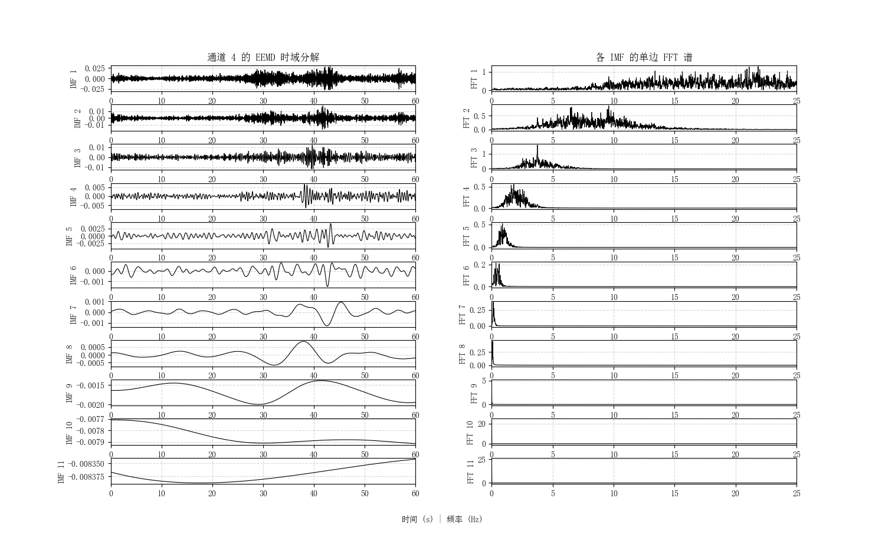

# 🧩 特征分析 - 加速度 EEMD 分解模块

> 城市生命线安全工程 | 加速度特征分析 | IMF 模态识别 | EEMD + FFT | 结构异常识别

------

## 📚 项目背景

在桥梁、地铁、建筑等工程结构中，**竖向加速度** 是衡量结构动力响应与健康状态的关键指标。传统频域分析虽能揭示主频特征，但对于**非平稳与非线性信号**往往力不从心。

本模块基于 **集合经验模态分解（EEMD）** 方法，可将原始加速度数据分解为若干**固有模态函数（IMFs）**，并结合 FFT 分析每个 IMF 的频域特性，从而实现对结构振动成分的细粒度解析，为模态识别、异常检测、损伤预警提供支撑。

------

## 📌 模块简介

本模块为**城市生命线安全工程监测平台桥梁专项-特征分析子模块**，用于对加速度信号进行非线性振动分解。功能包括 **加速度通道选择、EEMD 分解、IMF 时域及频谱分析可视化**，支持灵活配置采样点数、通道编号、噪声宽度等参数，具备良好的可扩展性和可集成性。

| 项目         | 内容                                                         |
| ------------ | ------------------------------------------------------------ |
| **模块名称** | `acc_eemd_decompose`                                         |
| **核心函数** | `load_and_preprocess`, `perform_eemd`, `plot_imfs`,`eemd_main` |
| **作者**     | 肖图刚                                                       |
| **开发时间** | 2025‑05‑30                                                   |
| **最后修改** | 2025‑06‑17（完善模块结构与示例脚本，支持自动通道配置）       |


------

## 🌟 功能描述

✅ **支持任意通道加速度信号分析**（默认第4通道）
 ✅ **非平稳振动信号分解**：EEMD 提取主要模态
 ✅ **每个 IMF 可视化分析**：时域波形 + 单边幅值谱
 ✅ **自动通道验证与错误检查**：保障鲁棒性
 ✅ **可视化输出美观统一，适配报告排版**

------

## 📂 输入数据说明

- **文件格式**：空格或制表符分隔的纯文本 `.txt`
- **列结构**：`time | ch1 | ch2 | … | chN`
- **采样点数**：默认取前 3000 点（可自定义）
- **采样频率 `fs`**：默认为 50 Hz（需指定）
- **通道编号**：从 0 开始计数（默认分析第4列）

------

## ⚙️ 运行环境与依赖

- **Python** ≥ 3.9.16
- **依赖库**
  - numpy ≥ 2.2.0
  - matplotlib ≥ 3.9.4
  - PyEMD ≥ 1.6.4

> 📝 **模块兼容 Jupyter 和命令行运行环境**

------

## 🛠️ 快速使用说明

📁 安装依赖：

```bash
pip install -r requirements.txt
```

📁 安装模块：

```bash
pip install -e .
```

✅ 运行示例：

```bsh
python example.py
```

或在代码中调用：

```python
"""Minimal demo for acc_eemd."""
from pathlib import Path

import pandas as pd  # only for demonstration of path resolution

from acc_eemd_decomposition import eemd_main

# Assume data file placed at project root
data_file = f"datasets/2023-04-24_01_00_2min.txt"

# Run full pipeline
eemd_main(data_path=str(data_file))
```

------

## 🔢 主要流程

1. **读取并验证数据** `load_and_preprocess`
2. **执行 EEMD 分解** `perform_eemd`
3. **可视化输出** `plot_imfs`：每个 IMF 的时域图与频谱图（单边 FFT）
4. **参数灵活可控**：支持采样点数、通道编号、EEMD 噪声参数自定义

------

## 💾 输出结果说明

| 类型       | 描述                               |
| ---------- | ---------------------------------- |
| 图像 PNG   | 每个 IMF 的波形与频谱图            |
| 控制台输出 | 分解通道、IMF 数量、信号长度等信息 |
| 返回对象   | `imfs`: `np.ndarray` 类型二维数组  |


**图例示例1**（IMF + FFT）：


**图例示例2**（IMF + FFT）：


------

## 🔁 后续优化建议

1. 支持生命线平台的在线通道数据处理自动化流程
2. 输出每个 IMF 的频率中心和能量比重
3. 增加对 IMF 能量谱的统计分析
4. 可扩展为 Dash / Streamlit 可交互平台