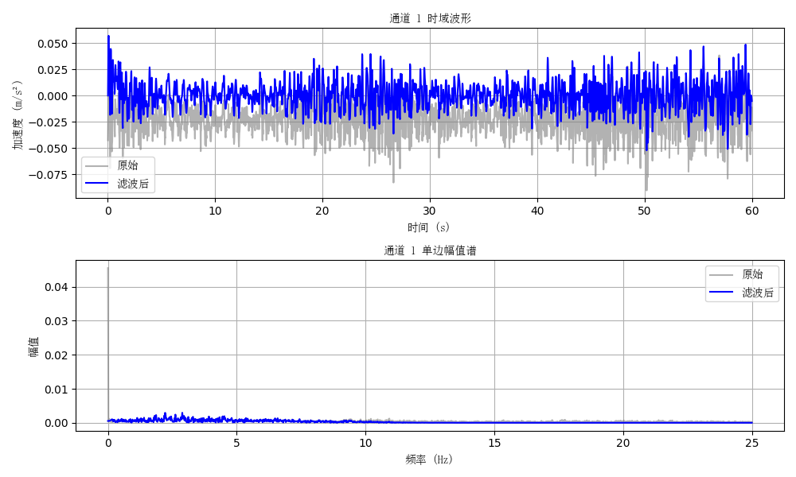
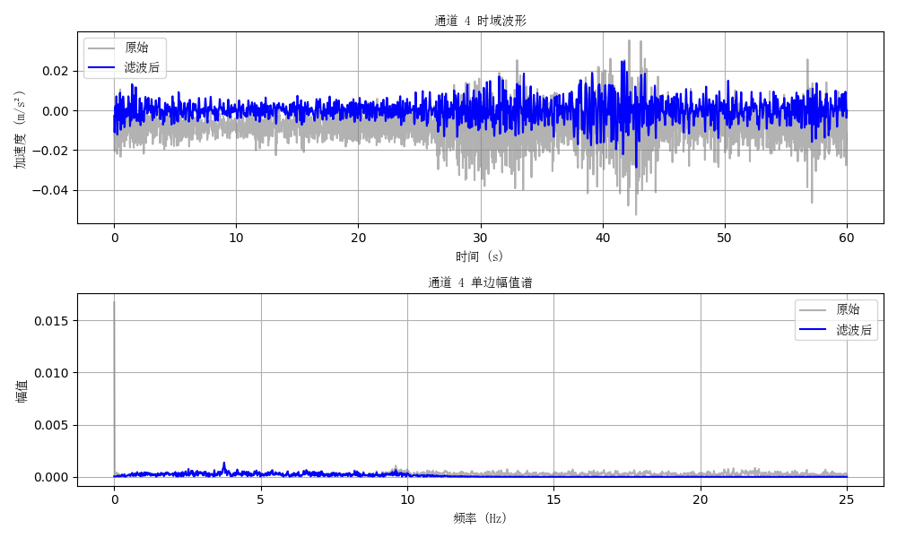
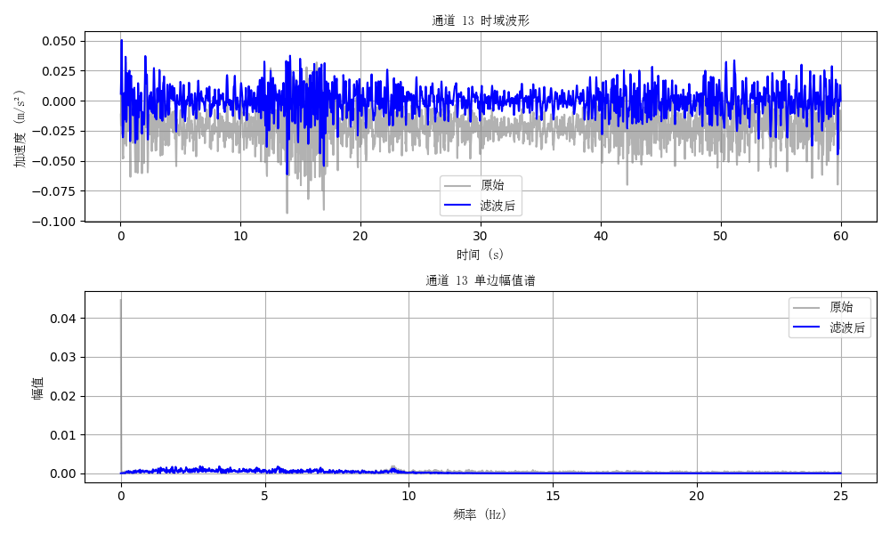
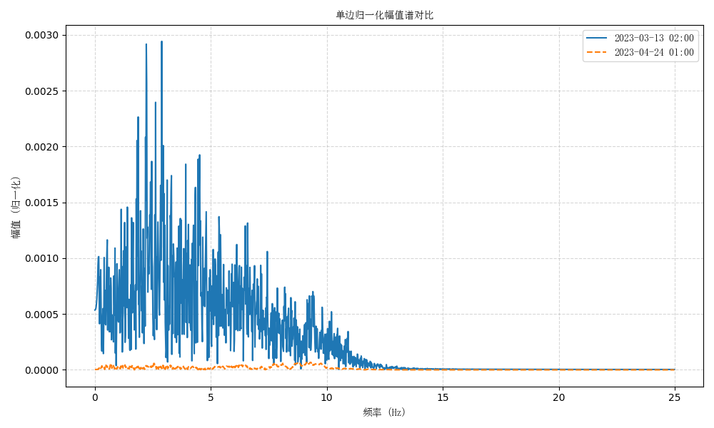

# ⚡️ 加速度频谱分析模块 

> 城市生命线安全工程 | 加速度频谱分析 | 加速度滤波分析 |多设备频谱分析| 多时段对比与可视化

------

## 📚 项目背景

在桥梁、地铁区间、建筑物顶层等结构健康监测场景中，**竖向加速度** 是反映振动特征与载荷效应的首要指标。通过频域分析可以直观识别主振峰、谐振区及异常能量带，为模态频率预警、疲劳评估和运营限速提供数据支撑。

本模块以 **快速傅里叶变换 (FFT)** 为核心，可对**单通道或多通道**加速度数据进行频谱分析，并提供 **Butterworth 带通滤波**、**多时段频谱对比** 等功能，便于监测人员快速定位结构动力特征变化。

------

## 📌 模块简介

本模块为**城市生命线安全工程监测平台桥梁专项-加速度数据分析**的核心模块，包含**单通道频谱分析、多时段频谱分析、多设备频谱分析和滤波分析**四个关键功能。模块基于快速傅里叶变换（FFT）及 Butterworth 滤波器设计，支持对结构监测中的原始加速度数据进行自动化频谱提取和多时段振动特征对比，为结构模态识别、损伤定位和预警评估提供支撑。

| 项目         | 内容                                                         |
| ------------ | ------------------------------------------------------------ |
| **模块名称** | `acc_spectral_analyse`                                       |
| **核心函数** | `load_data`, `apply_bandpass_filter`, `plot_fft_comparison`, `compare_two_files` |
| **作者**     | 肖图刚                                                       |
| **开发时间** | 2025‑06‑10                                                   |
| **最后修改** | 2025‑06‑16（新增滤波功能与多时段对比功能，版本号升级至 v0.2.0） |

------

## 🌟 功能描述

✅ **单/多通道 FFT**：输出单边归一化幅值谱
 ✅ **可选带通滤波**：Butterworth 0.16 – 10 Hz（默认，可配置）
 ✅ **多时段频谱对比**：一键对比同设备不同时段能量分布差异
 ✅ **高分辨率可视化**：时域‑频域双图，中文/英文双字体
 ✅ **功率谱导出**：FFT 结果可保存 CSV 便于二次分析
 ✅ **模块化接口**：易于集成至桥梁监控、城市生命线平台及后续开发

------

## 📂 输入数据说明

- **文件格式**：空格或制表符分隔纯文本 `.txt` / `.dat`
- **列结构**：`time | ch1 | ch2 | … | chN`（至少两列）
- **采样频率 `FS`**：示例 50 Hz，可在脚本中自定义
- **采样点数**：默认截取 3000 点做示例，实际分析时可根据计算时间动态调整

------

## ⚙️ 运行环境与依赖

- **Python** ≥ 3.9.16
- **依赖库**
  - numpy ≥ 2.2.4
  - pandas ≥ 2.2.3
  - matplotlib ≥ 3.10.3
  - scipy ≥ 1.15.2

> 📝 **使用建议**
>
> - 低频研究可适当下调 `LOWCUT`；若关注高阶模态，可上调 `HIGHCUT`。
> - 多通道绘图时，避免一次性选过多通道导致图像过密，可分批绘制。

------

## 🛠️ 快速使用说明

📁 安装依赖

```bash
pip install -r requirements.txt
```

📁 安装模块

```bash
pip install -e .
```

✅ 安装成功后，可直接运行示例：

```bash
python example.py                # 多通道 FFT 绘图
python example_filter.py         # 单文件 滤波 + FFT 对比
python example_multi_time.py  # 两时段单通道频谱对比
```

核心调用范式：

```python
### example.py  
"""示例脚本：读取数据 → 滤波 → FFT → 绘图"""
from acc_spectral_analyse import load_data, apply_bandpass_filter, plot_fft_comparison
# ============================================
# 参数设置
# ============================================
FILEPATH = "datasets/2023-03-13_02_00_2min.txt"  
# 加速度数据文件路径。文件应为以空格或制表符分隔的纯文本文件，
# 第一列为时间戳，其余为多个加速度通道。

SAMPLE_POINTS = 3000  
# 指定从文件中读取的采样点数。默认截取前3000点用于分析，
# 主要用于控制处理数据的长度，避免全文件计算耗时过长。

FS = 50  
# 数据采样频率（Hz）。表示每秒采样50次，是进行频谱分析和滤波设计的基础参数。

LOWCUT, HIGHCUT = 0.16, 10  
# 带通滤波器的下限频率和上限频率（Hz）。
# 仅保留 0.16~10 Hz 范围内的信号成分，滤除其他频段的噪声或无关频率成分。

CHANNELS = [0, 3, 12]  # 多通道分析
# CHANNELS = [12]  # 单通道分析
# 选择分析和绘图的通道编号（从 0 开始）。
# 可为单个通道（如 [12]）或多个通道组合（如 [0, 3, 12]）。
# 实际对应原始数据文件的第 2、第 5、第 13 列加速度信号。

# ============================================
# 数据处理与可视化流程
# ============================================

# 读取原始加速度数据（时间戳 + 多通道信号）
t, x_raw = load_data(FILEPATH, SAMPLE_POINTS)

# 对多通道加速度数据应用 Butterworth 带通滤波器
x_filt = apply_bandpass_filter(x_raw, FS, LOWCUT, HIGHCUT)

# 绘制选定通道的时域波形与单边幅值频谱对比图
plot_fft_comparison(t, x_raw, x_filt, FS, CHANNELS)
```

------

## 🔢 主要流程

1. **读取数据** `load_data`（时间 + 多通道加速度）
2. **可选带通滤波** `apply_bandpass_filter`
3. **FFT 变换** 内部 `_compute_fft` 生成单边幅值谱
4. **结果可视化** `plot_fft_comparison` 时域‑频域双图
5. **多时段对比** `compare_two_files` 一键绘制两曲线差异

------

## 💾 输出结果说明

| 类型               | 说明                                      | 示例文件                             |
| ------------------ | ----------------------------------------- | ------------------------------------ |
| 频谱图 PNG         | 单/多通道单文件 FFT 对比                  | `figures/ch1_fft_2023‑03‑13.png`     |
| 多时段频谱对比 PNG | 同设备两时段单通道幅值谱对比              | `figures/compare_03‑13_vs_04‑24.png` |
| 频谱 CSV（可选）   | 每通道功率谱，列名 `freq_Hz，ch_1，ch_2…` | `output/fft_power_03‑13.csv`         |









> 运行示例脚本时，程序会自动在终端打印文件保存路径。

🔎 **说明**

- 当前模块以 **离线监测数据** 演示；后续可对接城市生命线平台的 **实时加速度流**，用于在线频谱监控、阈值报警与趋势对比。

------

## 🔁 后续优化建议

1. 支持批量文件循环分析、自动生成日报/周报
2. 引入 Welch、PSD 等功率谱密度估计方法
3. 支持输出 SVG 和矢量 PDF 以适配报告排版
4. 可拓展为 Dash / Streamlit 前端，实现交互式频谱浏览
   [返回首页](../index.md)