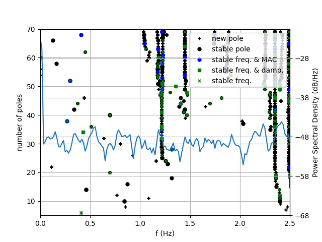

# 🌀 自动模态频率识别模型

> 城市生命线安全工程 | 结构健康监测 | 模态参数识别 | 自动化模态聚类与可视化

------

## 📚 项目背景

桥梁、超高层和大型土木结构在服役期内会因材料老化、连接松弛、荷载变化和环境侵蚀等因素出现刚度退化。**模态参数**（模态频率、阻尼比、振型）是最灵敏的动力性能指标之一，当结构受损或受力路径改变时，模态频率往往率先发生可观测的下降或漂移。

传统模态识别常依赖商业软件或 MATLAB® Toolbox，难以与在线监测平台无缝集成。本模块基于 **协方差驱动随机子空间辨识 (SSI‑COV)** 方法，提供一条 **从原始响应信号到稳定模态频率自动提取** 的纯 Python 解决方案，可直接嵌入城市生命线监控平台，实现长期在线健康评估。

------

## 📌 模型简介

该模块为 **城市生命线监测平台桥梁数据分析的子模块：自动模态频率识别模型，同时也是预警体系核心子模块Ⅷ  ：模态频率预警模型**的关键前置功能模块，通过 SSI‑COV 和稳定极点的聚类算法对实时监测的加速度（可更换为动位移）数据自动识别输出可靠的模态频率，为模态频率预警模型获取稳定的数据来源。

- **模块名称**：`autossi`
- **主函数名称**：`autossi_main`
- **模型名称**：自动模态频率识别模型
- **作者**：肖图刚
- **开发时间**：2025年6月10日
- **最后修改**：2025年6月12日

------

## 🌟 功能描述

✅ **NExT**：自然激励技术自动提取脉冲响应函数 (IRF)
 ✅ **Toeplitz + SVD**：构造块 Toeplitz 矩阵并奇异值分解
 ✅ **模态参数识别**：自动输出频率、阻尼比、振型
 ✅ **稳定性判别**：多阶模型对比，标记稳定极点
 ✅ **极点聚类**：K‑Means 与潜力层次聚类双策略，筛选代表模态
 ✅ **结构化输出**：返回聚类频率及稳定性图绘制数据
 ✅ **无 模态识别商业软件 依赖**：纯 Python 实现，易于二次开发与集成

------

## 📂 输入数据说明

- **类型**：二维 NumPy 数组 `y`，形状 `[传感器数, 采样点数]`
- **采样间隔 `dt`**：单位 (s)
- **建议前处理**：去均值、去趋势，必要时带通滤波

------

## ⚙️ 运行环境与依赖

- **Python**：≥ 3.9.16
- **依赖库**：
  - numpy ≥ 1.26.4
  - scipy ≥ 1.13.0
  - scikit‑learn ≥ 1.5.2
  - pandas ≥ 2.2.3

> 📝 **使用建议**
>
> - 根据响应信号时长调节 `Nmin` / `Nmax` 及子段长度 `Ts`。
> - 若频率密集，适当放宽稳定性容差 (`eps_freq`, `eps_MAC`) 以免漏检。

------

## 🛠️ 快速使用说明

📁 安装依赖

```bash
pip install -r requirements.txt
```

📁 安装模块：

```bash
cd py_modu/autossi
pip install .
```

✅ 安装成功：

```nginx
Successfully installed autossi-0.1.0
```

⚙️ 运行示例（example.py）：

```python
import pandas as pd
import numpy as np
import argparse
import matplotlib.pyplot as plt
from autossi import autossi_main
from autossi import plotStabDiag
import os
import time  # 用于时间戳
from itertools import chain
from sklearn.cluster import KMeans

os.environ["LOKY_MAX_CPU_COUNT"] = "8"  # 你可以改成你的实际核心数

# 创建保存目录（如果不存在）
output_dir = 'output'
picture_dir = 'figures'
os.makedirs(output_dir, exist_ok=True)
os.makedirs(picture_dir, exist_ok=True)

# 初始化 -------------------------------------
data_path = 'data/'

for file_name in os.listdir(data_path):
    data = pd.read_csv(data_path + file_name)

    # 选择第4、5、7、8列的数据
    selected_columns = data.iloc[:, [3, 4, 6, 7]]

    # 转置矩阵
    rz = selected_columns.transpose().values

    dt = 0.02  # 时间步长
    fs = 1 / dt  # 采样频率

    # 获取rz矩阵的行数和列数 Nyy是传感器数量， N是时间步数
    Nyy, N = rz.shape

    # 应用SSI-COV方法 --------------------------------------
    fn0, paraPlot = autossi_main(rz, dt, Ts=45, Nmin=5, Nmax=70)

    paraPlot = argparse.Namespace(**paraPlot)

    # 从文件名中去掉扩展名
    base_name = os.path.splitext(file_name)[0]

    # 保存fn0到csv文件
    csv_filename = f'output/idmodal_{base_name}.csv'

    fn0_df = pd.DataFrame(fn0).T
    fn0_df.to_csv(csv_filename, index=False)

    print(f"fn0保存至文件: {csv_filename}")

    # 绘制稳定性图 ------------------------------------------------
    fig = plotStabDiag(paraPlot.fn, rz[0, :], fs, paraPlot.status, paraPlot.Nmin, paraPlot.Nmax)

    pic_filename = f'picture/stability_diag_{base_name}.png'

    fig.savefig(pic_filename)
    plt.close(fig)

    print(f"稳定性图保存至文件: {pic_filename}")

```

详细参数请见主函数 `autossi_main`的技术文档 。

------

## 🔢 主要流程

1. **NExT → IRF** 获取脉冲响应函数
2. **Toeplitz + SVD** 提取系统阶次特征
3. **逐阶模态识别** 频率 / 阻尼 / 振型
4. **稳定性对比** 标注稳定极点
5. **极点聚类** K‑Means + 层次聚类筛选代表模态
6. **输出结果** 返回频率 `fn` 及稳定性数据 `info`

------

## 💾 输出结果说明

**核心输出**

| 输出类型     | 说明                                         | 默认路径示例                                       |
| ------------ | -------------------------------------------- | -------------------------------------------------- |
| 模态频率 CSV | 代表性模态频率 `fn0`，文件名与原数据文件对应 | `output/idmodal_7Z_1_2023-04-21_21_00.csv`         |
| 稳定性诊断图 | 模态稳定性图（阶数 × 频率散点图）            | `picture/stability_diag_7Z_1_2023-04-21_21_00.png` |


> 每处理完一段监测数据，程序会在终端提示保存的文件路径，示例：
>
> ```bash
> fn0保存至文件: output/idmodal_7Z_1_2023-04-21_21_00.csv
> 稳定性图保存至文件: picture/stability_diag_7Z_1_2023-04-21_21_00.png
> ```

**CSV 字段说明**

| 列名           | 含义                      |
| -------------- | ------------------------- |
| `cluster_fn`   | 聚类后代表性模态频率 (Hz) |
| `median_zeta`  | 聚类内阻尼比中位数        |
| `cluster_size` | 聚类包含的极点数量        |

**稳定性图说明**

- 横轴：模型阶数
- 纵轴：模态频率 (Hz)
- 颜色 / 标记：极点稳定性类别
- 作用：快速查看频率随阶数变化的稳定区，辨识真实模态

**模态频率识别结果(csv):**

| 0           | 1           | 2           | 3           | 4           | 5           | 6           | 7           | 8           | 9           |
| ----------- | ----------- | ----------- | ----------- | ----------- | ----------- | ----------- | ----------- | ----------- | ----------- |
| 0.096796049 | 0.508367393 | 1.181561746 | 1.439088131 | 1.847654769 | 2.385378962 | 2.717038289 | 2.877676658 | 3.185031389 | 3.520934678 |



🔎 **说明**：

- 当前模型以 **离线实验数据** 进行算法验证；后续将在**城市生命线监测平台的在线实时数据**上部署，实现频率实时识别、趋势跟踪及预警联动。

------

## 🔁 后续优化建议

1. 集成自适应阈值，结合支座/裂缝模块实现多指标耦合预警
2. 引入小波去噪、EMD 等前处理，提高低信噪比场景可靠性
3. 开放 GPU 加速接口，支持大规模多桥梁群批量处理
4. 与 Streamlit 或 Dash 结合，提供交互式在线稳定性图可视化
[返回首页](../index.md)