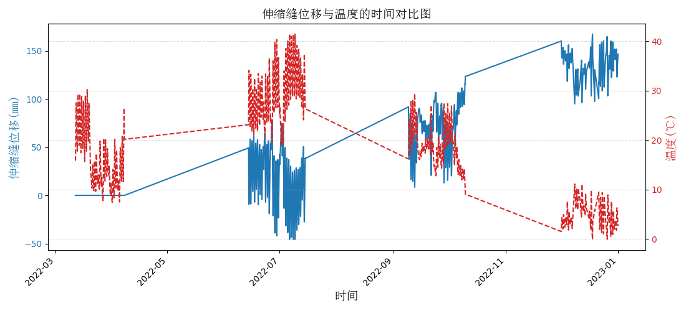
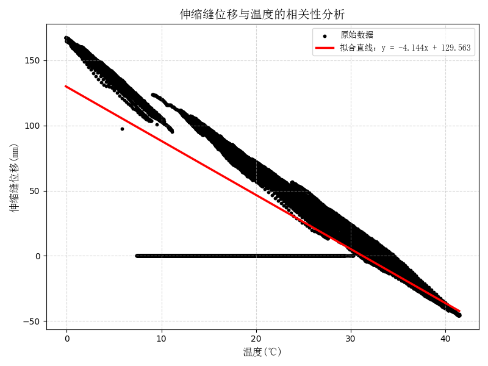

# 🔗相关性分析模块

> 城市生命线安全工程 | 结构健康监测 | 相关性建模 | 环境运营因素-结构响应分析 

------

## 📚 项目背景

桥梁结构在服役过程中受环境温度影响显著，尤其在多季节工况与温度梯度变化背景下，**结构响应（如梁端位移、主梁应变和裂缝宽度等）与环境运营因素如（温度、湿度和车辆荷载）的相关性**成为桥梁正常运行与健康评估的重要依据。比如梁端位移与温度关系通常呈现良好的线性响应，一旦脱离正常关联区间，可能表征支座阻滞、结构约束异常或构件变形积累等隐患。

传统方法依赖人工拟合或经验判断，难以动态更新与批量处理。为此，本模块面向**城市生命线监测平台的批量桥梁数据分析需求**，提供一个可插拔的**温度-位移关系建模与可视化分析工具**，支撑预警判断、异常检测与数据解释。

------

## 📌 模块简介

该模块为 **城市生命线监测平台桥梁专项分析子模块：相关性分析模型**，核心功能为建立结构响应与环境运营因素之间的统计关系模型，并输出拟合图像与分析结果，辅助结构响应异常的工程解释和预警判断。

- **模块名称**：`correlation_analysis`
- **主函数名称**：`core`
- **模型名称**：相关性分析模型
- **作者**：肖图刚
- **开发时间**：2025年6月17日
- **最后修改**：2025年6月17日

------

## 🌟 功能描述

✅ **多桥梁数据支持**：支持批量分析多组桥梁结构响应-环境运营因素关系
 ✅ **相关性拟合**：可选线性拟合 / 二次拟合 / 三次拟合
 ✅ **可视化分析图自动输出**：自动绘制位移-温度关系图，展示拟合曲线与散点分布
 ✅ **模型性能指标输出**：输出 $R^2$、RMSE 等评价指标
 ✅ **工程数据适配**：自动跳过无效/空值数据，支持定制字段名
 ✅ **模块化封装**：便于集成入预警平台、边缘计算或 Web 可视化系统

------

## 📂 输入数据说明

- **输入格式**：CSV 文件
- **字段要求**：
  - 第一列：时间戳（可跳过）
  - 第二列：结构响应（如位移）
  - 第三列：环境变量（如温度）
- **默认字段解释**：
  - `displacement`：伸缩缝或梁端纵向位移值，单位 mm（或 μm）
  - `temperature`：环境温度或构件温度，单位 ℃

> 📝 示例 CSV 文件：
>
> ```python
> timestamp, displacement, temperature
> 2023-04-01 00:00:00, 12.3, 25.6
> 2023-04-01 00:10:00, 12.8, 26.1
> ...
> ```
>
> ⚙️ 运行环境与依赖

- **Python**：≥ 3.9.16
- **依赖库**：
  - numpy ≥ 1.26.4
  - pandas ≥ 2.2.2
  - matplotlib ≥ 3.8.4
  - scikit-learn ≥ 1.5.0

------

## 🛠️ 快速使用说明

📁 安装依赖：

```bash
pip install -r requirements.txt
```

📁 安装模块：

```bash
cd py_modu/correlation_analysis
pip install -e .
```

✅ 安装成功：

```nginx
Successfully installed correlation_analysis-0.1.0
```

⚙️ 运行示例：

```bash
python example.py
```

或在脚本中调用：

```python
"""Minimal example showing how to use correlation_analysis."""
import pandas as pd
from correlation_analysis import (
    correlation_analysis,
    plot_correlation,
    plot_time_series_comparison,
)

# 读取示例数据（使用时需替换为自己的 csv或在线数据）
DATA_PATH = "datasets/wy-temp_10min.csv"

df = pd.read_csv(DATA_PATH, index_col=0, parse_dates=True)

disp_col = "Wy07"
# 温度列示例：除了位移与其他非温度列外剩余全是温度
temp_cols = [c for c in df.columns if c not in ["Wy07", "Wy10"]]

# 时间序列对比
plot_time_series_comparison(df, time_col=None, disp_col=disp_col, temp_cols=temp_cols)

# 相关性分析
x_data, y_data, model = correlation_analysis(df, x_cols=temp_cols, y_col=disp_col)
plot_correlation(x_data, y_data, model, x_name="温度", y_name="伸缩缝位移")
```

------

## 🔢 主要流程

1. **数据读取**：加载CSV数据，解析温度与位移列
2. **异常值剔除**：自动跳过空值和非数值数据
3. **关系建模**：支持线性、一元二次和三次回归建模
4. **评价指标计算**：输出 R²、RMSE、残差分布
5. **图像绘制与保存**：生成结果图并自动保存

------

## 💾 输出结果说明

| 输出类型       | 内容说明                  | 示例路径                           |
| -------------- | ------------------------- | ---------------------------------- |
| 拟合图像 (PNG) | 位移-温度散点与拟合曲线图 | `figures/bridge01_fit_linear.png`  |
| 拟合指标 (CSV) | 拟合系数、R²、RMSE 等     | `outputs/bridge01_fit_metrics.csv` |


图像说明：

- 横轴：温度 (℃)
- 纵轴：位移 (mm)
- 蓝点：原始监测数据
- 红线：拟合关系曲线
- 阴影带：残差范围

CSV 指标说明：

| 字段名   | 含义                         |
| -------- | ---------------------------- |
| model    | 使用的拟合类型（如 linear）  |
| r2_score | 拟合决定系数 R²              |
| rmse     | 均方根误差                   |
| coef_*   | 回归系数（视模型复杂度而定） |


------

## 📷 示例图像展示






------

## 🔁 后续优化建议

1. 支持温度滞后影响建模（引入滑动平均或滞后项）
2. 支持结构响应拓展到应变挠度等其他响应，环境运营因素拓展到湿度和车辆荷载等
3. 支持与生命线平台的在线数据接入和分析结果输出的交互
4. 接入 Streamlit 或 Dash，部署图形化交互界面
5. 引入异常检测模块，实现多级异常报警
   [返回首页](../index.md)