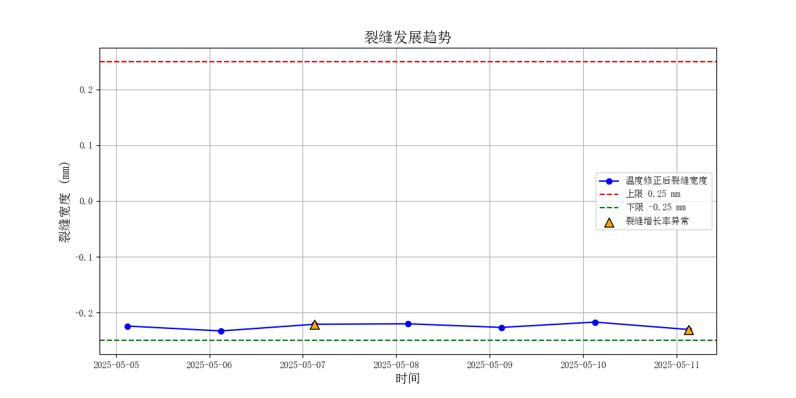

# 🌉  混凝土主梁裂缝超限预警模型

> 城市生命线安全工程 | 裂缝宽度监测 | 多元回归建模 | 分级异常识别与可视化

------

## 📚 项目背景

混凝土主梁作为桥梁的核心承重构件，其裂缝的发展直接关系到结构的安全性与耐久性。裂缝宽度在服役期内会因温度、湿度、荷载等环境与运营因素发生一定变化，部分微小波动属正常范畴。然而，一旦裂缝扩展异常或突破预设安全阈值，可能意味着局部损伤的恶化，甚至会发展到整体结构破坏，需及时识别并预警。

本模块通过构建 **裂缝宽度与环境因子的回归关系模型**，结合 **残差动态阈值分级判别**，对裂缝宽度进行基准预测和多级异常监测。支持裂缝异常趋势可视化、历史数据批量分析和多级报警点自动提取，适用于桥梁结构健康监测系统和城市生命线安全工程的集成部署。

------

## 📌 模型简介

该模块为 **城市生命线安全工程监测平台桥梁预警体系核心子模块Ⅵ：混凝土主梁裂缝超限预警模型**，旨在识别裂缝宽度在环境变化影响下的非正常发展趋势，并通过回归建模与动态残差分析实现 **多级智能预警**。

- **模块名称**：`crack_detection_alert`
- **模型名称**：混凝土主梁裂缝超限预警模型
- **作者**：肖图刚
- **开发时间**：2025年5月30日
- **最后修改**：2025年6月12日

------

## 🌟 功能描述

✅ 加载并处理裂缝宽度及其环境监测数据（支持缺失值处理、时间对齐）
 ✅ 基于温度、湿度等外部因素构建裂缝宽度的基准预测模型（默认线性回归）
 ✅ 计算残差并基于标准差动态设定多级预警阈值（默认三级）
 ✅ 自动识别超限点并输出对应时间与等级标记
 ✅ 绘制实测宽度与预测值变化趋势、动态阈值曲线及预警标注图
 ✅ 支持扩展至随机森林、SVR 等机器学习模型，实现多算法比较分析

------

## 📂 输入数据说明

- **格式**：本地 CSV 文件（带表头）
- **建议字段结构**：

| timestamp           | crack_width (mm) | temperature (°C) |
| ------------------- | ---------------- | ---------------- |
| 2025-05-01 08:00:00 | 0.28             | 27.1             |


- **数据来源**：主梁裂缝宽度计传感器 + 温湿度环境监测仪
- **采样频率**：10分钟均值、1小时重采样或日均值均可
- **特别说明**：环境因子字段可自定义扩展，如湿度、风速、车流量等

------

## ⚙️ 运行环境与依赖

- **Python**：≥ 3.9.16
- **依赖库**：
  - pandas ≥ 2.2.3
  - numpy ≥ 1.26.4
  - matplotlib ≥ 3.9.4,
  - scikit-learn ≥ 1.5.2
  - tabulate ≥ 0.9.0

> 📝 **使用建议**
>
> - 模型参数如预警等级标准差倍数、回归模型可根据监测桥梁的实际特性灵活配置；
> - 建议结合巡检结果验证异常识别结果，辅助桥梁维养决策；
> - 支持定期训练更新回归模型，增强预测适应性。

------

## 🛠️ 快速使用说明

📁 安装依赖：

```bash
pip install -r requirements.txt
```

📁 安装模块：

```
bash
cd py_modu/crack_detection_alert
pip install .
```

✅ 安装成功：

```nginx
Successfully installed crack_detection_alert-0.1.0
```

⚙️ 运行示例（example.py）：

```python
import pandas as pd
from crack_detection_alert import (
    load_data, train_temperature_model, apply_temperature_correction,
    compute_growth_rate, check_anomalies, plot_crack_trend,print_crack_alert_points
)

train_file = 'D:/pycode/lifeline_bridge_alert/datasets/crack_temp_train.csv'
test_file = 'D:/pycode/lifeline_bridge_alert/datasets/crack_temp_test.csv'

# 设置参数
thresholds = (0.25, 0.01, -0.25, -0.01)
ref_temp = 25.0

# 先读取 CSV，确认温度通道个数
df_temp = pd.read_csv(train_file, header=None)
n_cols = df_temp.shape[1]
temp_count = n_cols - 2  # 除去时间戳和裂缝宽度
temp_columns = [f'temp_{i+1}' for i in range(temp_count)]

# 加载训练数据，训练模型
train_df = load_data(train_file, temp_columns)
a, b = train_temperature_model(train_df)

# 加载测试数据并修正
test_df = load_data(test_file, temp_columns)
test_df, baseline_crack = apply_temperature_correction(test_df, a, b, ref_temp)

# 计算增长率
current_width = test_df['crack_true'].iloc[-1]
avg_rate, max_rate = compute_growth_rate(test_df)

# 判断异常
if check_anomalies(current_width, avg_rate, max_rate, thresholds):
    print("裂缝异常预警!")
else:
    print("✅ 裂缝状态正常。")

# 打印裂缝预警点
print_crack_alert_points(test_df,
                         crack_col='crack_true',
                         width_th=thresholds[0],
                         min_width_th=thresholds[2],
                         growth_th=thresholds[1],
                         min_growth_th=thresholds[3])

# 绘图
plot_crack_trend(test_df,
                 crack_col='crack_true',
                 threshold=thresholds[0],
                 min_threshold=thresholds[2],
                 growth_th=thresholds[1],
                 min_growth_th=thresholds[3])


```

------

## 💾 输出结果说明

- **核心输出**：
  - `crack_alert_output.csv`：包含裂缝宽度时序值、增长率、异常类别标识
  - `crack_alert_plot.png`：裂缝发展趋势图，标注异常增长点及预警阈值线
  - 控制台打印输出异常裂缝点及预警类别详情，便于快速浏览
- **输出字段说明**（CSV）：

| timestamp           | crack_width (mm) | growth_rate (mm/day) | alert_type            |
| ------------------- | ---------------- | -------------------- | --------------------- |
| 2025-05-07 03:00:00 | -0.221           | +0.012               | 正增长异常（> 0.01）  |
| 2025-05-11 03:00:00 | -0.231           | -0.011               | 负增长异常（< -0.01） |


- **控制台输出说明**：按四种类型汇总预警信息并打印：
  - ✅ **【裂缝宽度 > 0.25 mm】**：提示是否存在宽度超限点
  - ✅ **【裂缝宽度 < -0.25 mm】**：提示是否存在反向超限点
  - ✅ **【增长率 > +0.01 mm/天】**：表示裂缝快速扩展，需重点关注
  - ✅ **【增长率 < -0.01 mm/天】**：表示裂缝显著闭合，可能存在受力变化或测量误差
- **实际输出示例**：

 

🔎 **说明**：本模块当前以 **裂缝宽度阈值 + 日增长率双重标准** 实现预警分类，便于识别裂缝超限或发展趋势异常的情况。支持未来拓展更多判断逻辑（如累计扩展率、周期性波动分析等）。

------

## 🔁 后续优化建议

1. 增加模型选择接口（如机器学习智能算法 SVR、RF、XGBoost）提高适应性
2. 拓展支持交通流、荷载等多源信息融合建模
3. 对接实时数据库，实现在线异常监测与滚动预警
4. 支持时变模型训练与趋势对比，增强长期监测能力