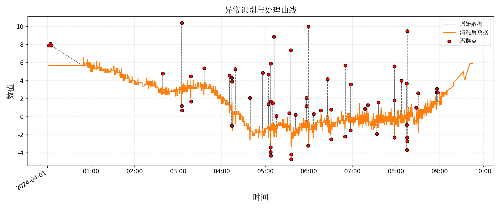

# 📊 异常识别与处理

> 城市生命线安全工程 | 监测数据预处理 | 异常数据识别 | 滑动中位数与MAD 方法| 数据补全与可视化 |

## 📚 项目背景

在桥梁结构健康监测系统中，采集到的温度、应变、位移等传感器数据可能由于设备漂移、环境扰动或通信故障出现突变或缺失，直接影响后续的数据建模与预警分析。

为提升监测数据的可信度和稳定性，构建本模块用于**自动识别异常点并进行数据清洗与补全**，为城市桥梁生命线安全平台提供基础数据保障。

## 📌 模块简介

本模块为**城市生命线安全工程监测平台桥梁专项的数据分析子模块：异常识别与处理**，支持**单通道时间序列**的异常点识别与自动补全，采用鲁棒滑动中位数与MAD的迭代方法，结合插值与前后填充方法进行数据补全，支持图像与终端表格输出。

| 项目         | 内容                                                |
| ------------ | --------------------------------------------------- |
| **模块名称** | data_preprocessing    |
| **核心功能** | 滑动中位数+MAD异常检测、数据插值补全、图表输出      |
| **典型应用** | 结构健康数据预处理、预警建模前清洗步骤、图形展示    |
| **作者**     | 肖图刚                                              |
| **开发时间** | 2025‑06‑24                                          |
| **最后修改** | 2025‑06‑24（新增异常点表格输出与方法信息提示）      |
| **支持平台** | 城市生命线安全工程监测平台 / 地市级桥梁结构健康系统 |

## 🌟 功能描述

✅ **基于滑动中位数与MAD的鲁棒异常检测**（多轮迭代剔除）

✅ **数据修复功能**：插值 + 向前向后填充组合补全缺失

✅ **图像对比可视化**：原始数据、清洗数据与异常点同图显示

✅ **终端表格输出异常点详情**：含时间与数值，支持 tabulate 美化格式

✅ **支持中文输出与图例美化**（内置中文字体设置）

✅ **模块化封装，便于外部调用与集成**

## 📂 输入数据说明

- **文件格式**：CSV
- **时间列名**：`time`
- **数据列名**：`value`

| 时间                | value |          |
| ------------------- | ----- | -------- |
| 2025-06-01 00:00:00 | 15.23 |          |
| 2025-06-01 01:00:00 | 15.27 |          |
| 2025-06-01 02:00:00 | 65.33 | ← 异常点 |

## ⚙️ 运行环境与依赖

- **Python** ≥ 3.9

| 库               | 版本要求 |
| ---------------- | -------- |
| numpy            | ≥ 2.0.2  |
| pandas           | ≥ 2.2.3  |
| matplotlib       | ≥ 3.9.0  |
| tabulate（可选） | ≥ 0.9.0  |

**安装依赖**：

```bash
pip install -r requirements.txt
```

## 🛠️ 使用说明

### 安装模块

```bash
pip install -e .
```

### 快速运行示例

```bash
python example.py
```

或在其他脚本中调用（example.py）：

```python
from pathlib import Path
import pandas as pd
from data_preprocessing import preprocess_series, plot_comparison, print_outliers

def main():
    csv_path = "datasets/temp_ori_1week.csv"
    out_path = "figures/异常识别与处理曲线.png"
    out_csv = "output/预处理后的数据.csv"

    df = pd.read_csv(csv_path)
    ts = pd.to_datetime(df["time"])
    series = pd.Series(df["value"].values, index=ts)

    cleaned, outliers, outlier_method_name, fill_method_name = preprocess_series(
        series, outlier_thresh=3, window_size=24, min_amplitude=1.0
    )

    print(f"📌 当前异常检测方法：{outlier_method_name}")
    print(f"📌 当前缺失数据补全方法：{fill_method_name}")

    plot_comparison(series.index, series, cleaned, outliers, out_path=out_path)
    print_outliers(series.index, series, outliers)

    Path(out_csv).parent.mkdir(exist_ok=True)
    pd.DataFrame({
        "时间": series.index,
        "原始值": series.values,
        "清洗后值": cleaned.values,
        "是否离群": outliers.values.astype(int)
    }).to_csv(out_csv, index=False)
    print(f"✅ 清洗结果已保存至: {Path(out_csv).resolve()}")

if __name__ == "__main__":
    main()

```

## 🔢 模块主要流程

1. **读取时间序列数据**（CSV）
2. **基于滑动中位数 + MAD 检测异常点**（可设置滑窗大小、阈值）
3. **多轮迭代清洗异常点并补全数据**（插值 + 填充）
4. **输出清洗前后对比图像**
5. **打印异常点详细表格**
6. **保存清洗结果到CSV**

## 📈 输出结果说明

- **清洗图像**：位于 `figures/异常识别与处理曲线.png`
- **清洗数据CSV**：位于 `output/预处理后的数据.csv`
- **终端输出**：打印包含异常检测方法、补全方法说明、异常点表格

示例表格输出：

```bash
📌 当前异常检测方法：鲁棒滑动中位数+MAD迭代检测
📌 当前缺失数据补全方法：时间插值 + bfill + ffill
✅ 图像已保存至: D:\pycode\lifeline_bridge_alert\py_modu\data_preprocessing\figures\异常识别与处理曲线.png

🛑 检测到的异常点数量：68 个
📋 异常点详细信息如下：
+----------------------------+----------+
| 时间                       |   异常值 |
+============================+==========+
| 2024-04-01 00:01:59.666000 |      7.9 |
+----------------------------+----------+
| 2024-04-01 00:03:47.571000 |      8.1 |
+----------------------------+----------+
| 2024-04-01 00:05:27.705000 |      7.9 |
+----------------------------+----------+
| 2024-04-01 02:38:50.455000 |      4.8 |
+----------------------------+----------+
| 2024-04-01 03:04:50.745000 |      1.2 |
+----------------------------+----------+
| 2024-04-01 03:05:02.012000 |     10.4 |
+----------------------------+----------+
| 2024-04-01 03:05:05.317000 |      0.7 |
+----------------------------+----------+
| 2024-04-01 03:17:37.660000 |      4.5 |
+----------------------------+----------+
| 2024-04-01 03:17:39.881000 |      1.7 |
+----------------------------+----------+
| 2024-04-01 03:35:43.352000 |      5.4 |
+----------------------------+----------+
| 2024-04-01 04:10:26.580000 |      4.6 |
+----------------------------+----------+
| 2024-04-01 04:13:50.868000 |     -1   |
+----------------------------+----------+
| 2024-04-01 04:13:53.203000 |     -1   |
+----------------------------+----------+
| 2024-04-01 04:13:56.524000 |      3.9 |
+----------------------------+----------+
| 2024-04-01 04:14:02.571000 |      4.3 |
+----------------------------+----------+
| 2024-04-01 04:18:35.679000 |      5.3 |
+----------------------------+----------+
| 2024-04-01 04:39:06.037000 |      2.1 |
+----------------------------+----------+
| 2024-04-01 04:56:22.928000 |      4.9 |
+----------------------------+----------+
| 2024-04-01 05:04:08.940000 |      4.7 |
+----------------------------+----------+
| 2024-04-01 05:04:19.305000 |      1.4 |
+----------------------------+----------+
| 2024-04-01 05:07:01.647000 |     -3.4 |
+----------------------------+----------+
| 2024-04-01 05:07:08.566000 |     -3.9 |
+----------------------------+----------+
| 2024-04-01 05:07:12.069000 |     -3.4 |
+----------------------------+----------+
| 2024-04-01 05:07:29.267000 |      5.9 |
+----------------------------+----------+
| 2024-04-01 05:07:31.710000 |      1.7 |
+----------------------------+----------+
| 2024-04-01 05:07:34.569000 |     -4.3 |
+----------------------------+----------+
| 2024-04-01 05:10:16.307000 |      1.5 |
+----------------------------+----------+
| 2024-04-01 05:11:59.141000 |      8.9 |
+----------------------------+----------+
| 2024-04-01 05:15:12.899000 |      0.1 |
+----------------------------+----------+
| 2024-04-01 05:32:41.679000 |      0.4 |
+----------------------------+----------+
| 2024-04-01 05:35:13.926000 |      7.4 |
+----------------------------+----------+
| 2024-04-01 05:35:29.621000 |     -4.7 |
+----------------------------+----------+
| 2024-04-01 05:35:31.489000 |     -4.2 |
+----------------------------+----------+
| 2024-04-01 05:41:47.965000 |      0.2 |
+----------------------------+----------+
| 2024-04-01 05:56:23.782000 |      2.1 |
+----------------------------+----------+
| 2024-04-01 05:56:27.029000 |      1.2 |
+----------------------------+----------+
| 2024-04-01 05:58:51.962000 |     -3.2 |
+----------------------------+----------+
| 2024-04-01 05:59:03.169000 |     10   |
+----------------------------+----------+
| 2024-04-01 06:06:31.034000 |      0.3 |
+----------------------------+----------+
| 2024-04-01 06:16:30.620000 |      0.7 |
+----------------------------+----------+
| 2024-04-01 06:25:33.698000 |      4.2 |
+----------------------------+----------+
| 2024-04-01 06:30:30.276000 |      0.8 |
+----------------------------+----------+
| 2024-04-01 06:30:34.157000 |     -2.5 |
+----------------------------+----------+
| 2024-04-01 06:49:35.503000 |     -2.2 |
+----------------------------+----------+
| 2024-04-01 06:49:38.647000 |     -2.2 |
+----------------------------+----------+
| 2024-04-01 06:49:57.899000 |      5.7 |
+----------------------------+----------+
| 2024-04-01 06:57:24.128000 |     -1.5 |
+----------------------------+----------+
| 2024-04-01 06:57:35.591000 |      3.6 |
+----------------------------+----------+
| 2024-04-01 07:17:02.714000 |      0.9 |
+----------------------------+----------+
| 2024-04-01 07:21:13.552000 |      1.3 |
+----------------------------+----------+
| 2024-04-01 07:33:36.218000 |     -1.9 |
+----------------------------+----------+
| 2024-04-01 07:35:35.549000 |      1.6 |
+----------------------------+----------+
| 2024-04-01 07:57:37.147000 |     -2.3 |
+----------------------------+----------+
| 2024-04-01 07:57:49.856000 |      1.8 |
+----------------------------+----------+
| 2024-04-01 07:57:57.467000 |      5.6 |
+----------------------------+----------+
| 2024-04-01 08:07:15.540000 |      4   |
+----------------------------+----------+
| 2024-04-01 08:14:26.695000 |     -0.9 |
+----------------------------+----------+
| 2024-04-01 08:14:45.982000 |      3.7 |
+----------------------------+----------+
| 2024-04-01 08:14:47.771000 |     -3.7 |
+----------------------------+----------+
| 2024-04-01 08:14:51.262000 |     -2.3 |
+----------------------------+----------+
| 2024-04-01 08:15:14.566000 |      9.5 |
+----------------------------+----------+
| 2024-04-01 08:15:17.393000 |     -2.7 |
+----------------------------+----------+
| 2024-04-01 08:27:43.900000 |      1   |
+----------------------------+----------+
| 2024-04-01 08:30:27.238000 |      2.6 |
+----------------------------+----------+
| 2024-04-01 08:55:57.133000 |      2.7 |
+----------------------------+----------+
| 2024-04-01 08:56:11.007000 |      2.7 |
+----------------------------+----------+
| 2024-04-01 08:56:16.461000 |      3.1 |
+----------------------------+----------+
| 2024-04-01 08:57:29.463000 |      2.7 |
+----------------------------+----------+
✅ 清洗结果已保存至: D:\pycode\lifeline_bridge_alert\py_modu\data_preprocessing\output\预处理后的数据.csv
```

示例输出图表：


## 🔁 拓展建议

1. **支持生命线平台的在线数据流**
2. **支持多通道批量清洗接口**（多传感器并行）
3. **支持滑动 GMM 异常检测与可自定义检测规则**
4. **集成流式数据处理**（用于边采边清洗的实时处理场景）
5. **拓展前端接口调用（如 Streamlit）**
[返回首页](../index.md)
