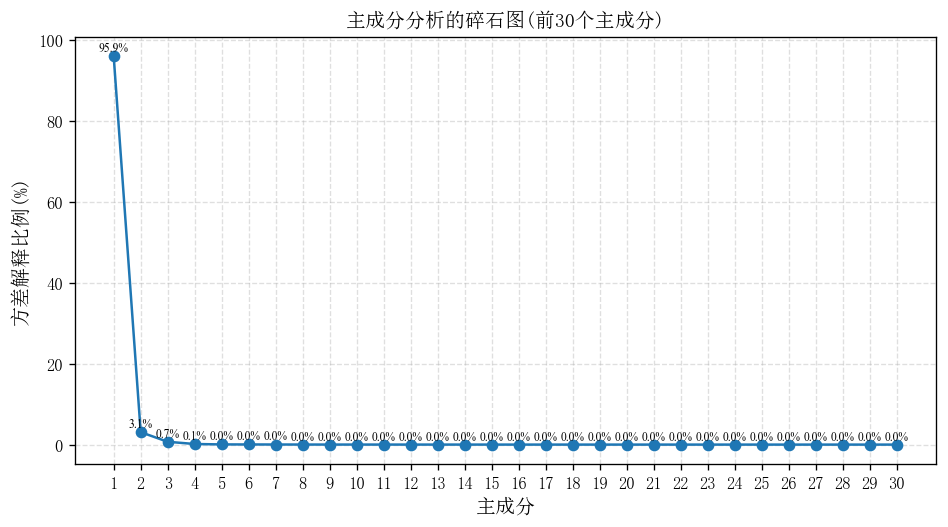
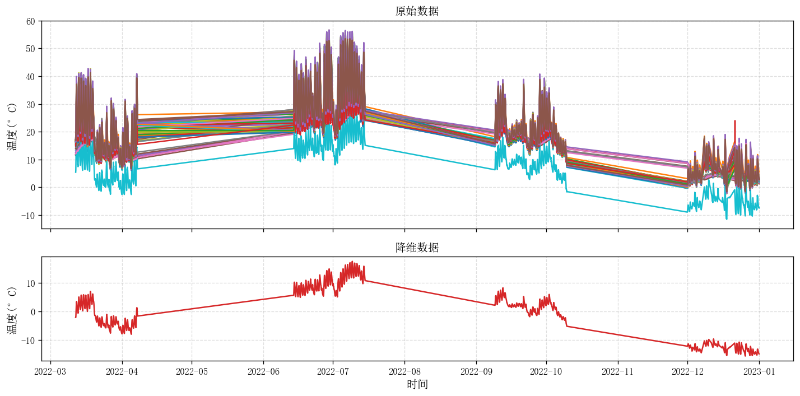

# 🧩 特征分析 - PCA数据降维模型

> 城市生命线安全工程 | 多通道数据处理 | 特征压缩与提取 | PCA 主成分分析 | 趋势监测与降维建模

------

## 📚 项目背景

在大型桥梁、隧道等城市生命线工程中，常部署多个温度传感器用于采集结构或环境温度数据。这些多通道数据往往呈现出**高相关、高冗余**等特征，直接使用可能导致建模效率低、解释性差。

本模块基于 **主成分分析（PCA）** 技术，能够对温度等高维数据进行有效压缩，将多个原始通道整合为少量综合特征，显著提升后续**异常识别、特征聚类、建模效率与可视化清晰度**，为智慧运维平台的温度趋势识别与特征分析提供强力支撑。

------

## 📌 模块简介

本模块为**城市生命线安全工程监测平台桥梁专项的特征分析子模块：PCA数据降维模型**，支持多通道温度、位移或挠度等高维数据的标准化处理、主成分提取、方差解释分析与趋势可视化，具备良好的通用性与平台可集成性。

| 项目         | 内容                                                         |
| ------------ | ------------------------------------------------------------ |
| **模块名称** | `feature_analysis`                                           |
| **核心函数** | `load_temperature`, `compute_pca`, `plot_scree`, `plot_combined`, `run_pipeline` |
| **作者**     | 肖图刚                                                       |
| **开发时间** | 2025‑06‑17                                                   |
| **最后修改** | 2025‑06‑18（优化模块结构与 README 展示，增强平台集成能力）   |

------

## 🌟 功能描述

✅ **支持任意数量温度通道分析**  
✅ **自动归一化标准化，消除量纲影响**  
✅ **基于 sklearn 高效 PCA 分解**：获取主成分 + 载荷矩阵  
✅ **碎石图自动绘制**：展示主成分解释力  
✅ **合成主成分趋势图**：与原始温度曲线对比展示  
✅ **支持一键调用，自动保存图像结果**

------

## 📂 输入数据说明

- **文件格式**：CSV 文件（推荐 UTF-8 编码）
- **列结构**：`time | temp1 | temp2 | … | tempN`
- **时间列**：自动识别时间戳（可为字符串）；若无时间列，则默认使用行号索引
- **通道数量**：建议 ≥ 4，降维优势明显
- **数据完整性**：缺失值需预处理（后续版本将支持自动插补）

------

## ⚙️ 运行环境与依赖

- **Python** ≥ 3.9.16
- **依赖库**
  - numpy ≥ 2.0.2
  - pandas ≥ 2.2.3
  - matplotlib ≥ 3.9.4
  - scikit-learn ≥ 1.6.1

> 📝 **模块兼容 Jupyter、命令行与平台集成运行环境**

------

## 🛠️ 快速使用说明

📁 安装依赖：

```bash
pip install -r requirements.txt
```

📁 安装模块：

```bash
pip install -e .
```

✅ 运行示例：

```bash
python example.py
```

或在 Python 代码中调用：

```python
"""Quick start example for pca_temp_analysis."""
from pathlib import Path
from feature_analysis import run_pipeline

DATA = "datasets/temp_10min.csv"
run_pipeline(DATA, out_dir="figures")
```

------

## 🔢 主要流程

1. **数据读取与标准化** `load_and_standardize`
2. **主成分提取分析** `perform_pca`
3. **碎石图绘制** `plot_scree_curve`：展示前 30 阶主成分解释率
4. **趋势图绘制** `plot_pc_sum`：展示前 3 个主成分与原始温度的合成对比
5. **信息输出**：控制台打印主成分解释率、保存图像至指定目录

------

## 💾 输出结果说明

| 类型       | 描述                                                        |
| ---------- | ----------------------------------------------------------- |
| 图像 PNG   | `主成分分析的碎石图；`原始数据&降维数据对比图               |
| 控制台输出 | 前 3 个主成分解释的总方差比例、主成分矩阵形状、原始通道数量 |
| 返回对象   | `pca`, `pcs`, `exp_var`                                     |

**终端输出**：

```bash
前 3 个主成分解释的总方差比例: 99.66%
Plots saved to D:\pycode\lifeline_bridge_alert\py_modu\feature_analysis\figures
```

**图例示例1**（碎石图）：



**图例示例2**（主成分趋势对比图）：



------

## 🔁 平台对接与后续优化建议

✅ **支持在线生命线平台的传感数据流分析与动态降维**，可基于滑动时间窗对主成分演化趋势进行连续追踪，适应长期状态评估与异常监测需求；

✅ **支持多源异构数据集扩展**，包括环境温度、湿度、风速、车流量等运营因素与结构响应信号（应变、位移、加速度）的联合降维与综合分析；

✅ **输出主成分贡献率与对应通道载荷（主成分载荷矩阵）**；

✅ **集成异常突变检测机制**，基于主成分序列构建结构响应的异常分数（如CUSUM/Bayesian Change Point Detection），对接报警模块，实现前端预警触发；

✅ **支持可交互式可视化平台（Streamlit / Dash）集成**，实现参数配置、通道选择、图表交互及报告自动导出等功能；

✅ **引入神经网络等非线性降维策略**，如自编码器（AutoEncoder）、t-SNE、UMAP 等，挖掘复杂非线性耦合关系；

✅ **支持相关性热力图与通道关联网络图生成**，基于皮尔逊相关系数或互信息，展示通道间耦合特征，辅助聚类与冗余分析；

------

> 模块版本：v0.1.0
>  项目负责人：肖图刚
>  开发单位：城市生命线工程技术中心