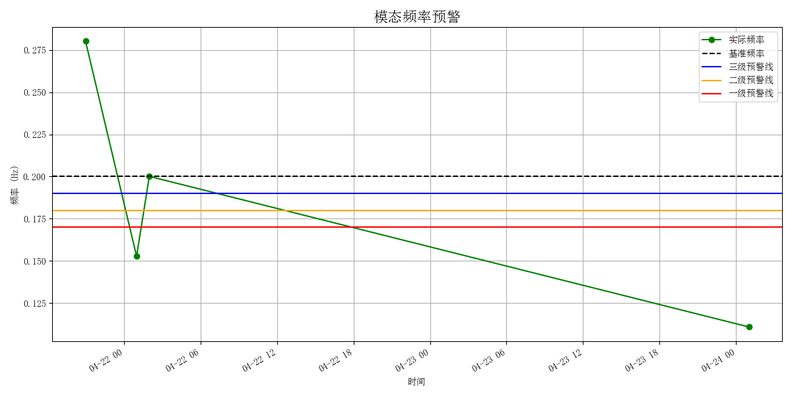

# 🌉 模态频率预警模型

> 城市生命线安全工程 | 模态频率监测 | 多级预警识别 | 趋势分析与可视化

------

## 📚 项目背景

桥梁结构的模态频率作为衡量其整体刚度和动力性能的重要指标，对结构安全评估具有显著意义。在长期服役过程中，模态频率可能因结构损伤、材料老化、支座异常等问题而发生下降，若下降幅度超过合理阈值，则可能预示结构性能退化或损伤风险。

本模块面向桥梁结构健康监测系统，通过提取**监测频率数据的变化趋势**，构建基于**基准频率的多级预警模型**，自动识别频率下降异常点，并实现可视化展示。支持批量频率文件处理、多级预警等级划分、趋势图自动绘制，适用于城市桥梁群的高频监测与智能预警。

------

## 📌 模型简介

该模块为 **城市生命线工程监测平台桥梁预警体系核心子模块Ⅷ：模态频率预警模型**，旨在通过频率与基准值的对比分析，实现模态性能退化的早期识别与分级预警。

- **模块名称**：`freq_alert`
- **模型名称**：桥梁模态频率预警模型
- **作者**：肖图刚
- **开发时间**：2025年6月10日
- **最后修改**：2025年6月12日

------

## 🌟 功能描述

✅ 支持批量读取监测频率数据（CSV 格式，自动解析时间戳）
 ✅ 基于基准频率计算下降幅度，划分正常 / 三级 / 二级 / 一级预警等级
 ✅ 输出完整的预警分析表格（时间、频率、下降比例、预警等级）
 ✅ 自动绘制频率变化趋势图与各级预警阈值线
 ✅ 控制台打印各级预警点列表（含频率数值和时间点）
 ✅ 适配多种监测频率数据文件，便于集成与部署

------

## 📂 输入数据说明

- **格式**：本地 CSV 文件（带列名），命名格式如 `idmodal_7Z_1_2023-04-21_21_00.csv`
- **字段结构要求**：

| 序号  | 含义         | 示例         |
| ----- | ------------ | ------------ |
| 第1行 | 列名         | -            |
| 第2行 | 第一阶频率值 | 0.1925（Hz） |

- **数据来源**：结构加速度响应分析提取的模态频率（自动识别结果，依赖于自动模态识别模块-autossi）
- **采样间隔**：1小时及更长
- **时间信息提取**：从文件名中自动解析（建议文件名包含年月日时分信息）

------

## ⚙️ 运行环境与依赖

- **Python**：≥ 3.9.16
- **依赖库**：
  - pandas ≥ 2.2.3
  - numpy ≥ 1.26.4
  - matplotlib ≥ 3.9.4
  - tabulate ≥ 0.9.0

> 📝 **使用建议**
>
> - 模型中基准频率、各级预警下降比例均可灵活配置；
> - 可与桥梁巡检或支座/裂缝等其他监测信息联合使用，实现预警交叉验证；
> - 支持将频率文件自动命名输出、嵌入定时任务中实现周期性批量分析。

------

## 🛠️ 快速使用说明

📁 安装依赖：

```bash
pip install -r requirements.txt
```

📁 安装模块：

```bash
cd py_modu/freq_alert
pip install .
```

✅ 安装成功：

```nginx
Successfully installed freq_alert-0.1.0
```

⚙️ 运行示例（example.py）：

```python
from freq_alert import batch_process_files, plot_frequency_alerts, print_alert_summary

BASE_FREQ = 0.20
DATA_DIR = "./datasets"
PATTERN = "idmodal_*.csv"

df_result = batch_process_files(DATA_DIR, PATTERN, BASE_FREQ)
print_alert_summary(df_result)     # 打印预警点信息
plot_frequency_alerts(df_result, BASE_FREQ)  # 绘图

```

------

## 💾 输出结果说明

- **输出文件**
  - `freq_alert_result.csv`：频率下降分析结果
  - `freq_alert_plot.png`：频率变化趋势图
- **输出字段说明**

| timestamp        | freq (Hz) | drop (%) | alert_level |
| ---------------- | --------- | -------- | ----------- |
| 2025-06-10 11:00 | 0.1892    | 5.40     | 三级        |
| 2025-06-11 11:00 | 0.1728    | 13.60    | 二级        |
| 2025-06-12 11:00 | 0.1682    | 16.10    | 一级        |

- **控制台输出**：支持 tabulate 表格美化输出，分预警等级汇总

```
===== 各级频率下降预警统计信息 =====

【一级预警】 (数量: 2)
+------------------+-------------+
|      时间点      |   频率 (Hz) |
+==================+=============+
| 2023-04-22 01:00 |    0.152768 |
+------------------+-------------+
| 2023-04-24 01:00 |    0.110871 |
+------------------+-------------+

【二级预警】 (数量: 0)
无预警。

【三级预警】 (数量: 0)
无预警。
```

- **频率趋势图展示说明**
  - 黑色虚线：基准频率线
  - 蓝色/橙色/红色线：三级、二级、一级预警阈值线
  - 绿色曲线：实际频率时序数据



🔎 **说明**：本模块当前基于 **其他项目的离线模态频率监测数据** 进行开发和验证，后续计划替换为城市生命线平台的在线实时数据，以实现更加高效、动态的结构健康监测与预警功能。模型支持多级频率下降预警，阈值灵活可调，适用于桥梁结构性能退化的早期识别。

------

## 🔁 后续优化建议

1. ✅ 引入频率平滑处理算法（如滑动平均、小波去噪等）
2. ✅ 支持 Excel / JSON 等多格式数据输入
3. ✅ 增加异常值剔除机制（如统计检测或机器学习方法）
4. ✅ 对接实时数据流，实现在线频率变化监测与滚动预警
5. ✅ 拓展支持多个频率通道与多阶模态联合预警
[返回首页](../index.md)