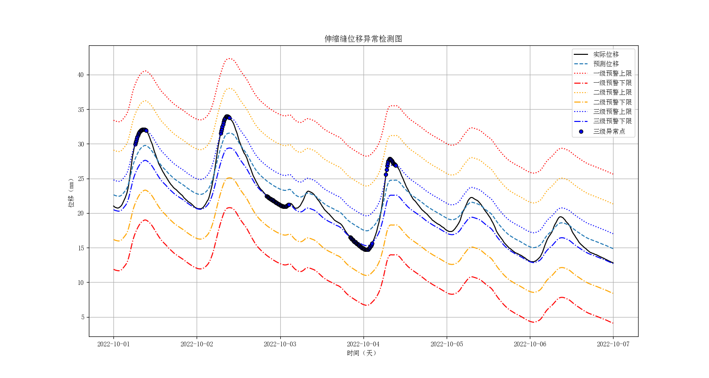

# 🌉 伸缩缝位移异常预警模型

>  城市生命线安全工程 | 结构健康监测 | 动态回归建模 | 多级预警与可视化

---

## 📚 项目背景

伸缩缝位移的异常变化是桥梁长期服役中常见的潜在病害。受环境温度等外部因素影响，伸缩缝位移会出现周期性波动。然而，若伸缩缝位移出现超出正常范围的异常波动，往往意味着结构局部受力状态改变或病害隐患，影响桥梁安全性与使用性能。

本模块基于动态回归建模和阈值分析方法，结合温度修正与残差动态阈值计算，实现伸缩缝位移的异常趋势判别和多级预警。模块具备 **趋势可视化、历史数据分析、多级预警判别** 等功能，支持集成至省级城市生命线安全监测平台。

---

## 📌 模型简介

本项目为 **城市生命线安全工程监测平台桥梁预警体系核心子模块Ⅱ：伸缩缝位移异常预警模型**，旨在识别伸缩缝在长期服役过程中的 **异常位移波动及潜在的损伤问题**。

模块利用温度修正、基准预测（线性回归）与滑动残差动态阈值分析，动态判断伸缩缝位移的波动是否超出预警阈值，实现 **正常、三级、二级、一级预警** 的多级判别。支持历史数据离线分析及图形化展示，也可拓展为在线监测系统的子模块。

- **模块名称**：`joint_displacement_alert`  
- **模型名称**：伸缩缝位移异常预警模型  
- **作者**：肖图刚  
- **开发时间**：2025年4月27日  
- **最后修改**：2025年6月11日

---

## 🌟 功能描述

✅ 加载并预处理历史监测数据（时间戳对齐、缺失值处理、10分钟均值降采样等）  
✅ 进行温度修正，计算平均温度特征，剔除环境温度影响  
✅ 建立位移预测基准模型（线性回归）并计算动态残差阈值  
✅ 滑动窗口实时判别异常位移点，分级预警（正常、三级、二级、一级）  
✅ 输出各级异常点数量及对应的时间戳  
✅ 可视化动态趋势图、位移-温度关系及多级预警判别结果  
✅ 模块化设计，支持拓展集成到结构健康监测平台

---

## 📂 输入数据说明

- **格式**：本地 CSV 文件（3列、无表头）  
- **数据内容**：  
  1️⃣ 时间戳（如 `2024-05-22 11:00:00`）  
  2️⃣ 伸缩缝位移（单位：mm）  
  3️⃣ 多通道温度（单位：℃，可多传感器温度数据取平均）  
- **数据来源**：桥梁伸缩缝监测系统或附近温度测点数据（建议覆盖一年或更长周期）  
- **采样频率**：10分钟均值或1小时重采样，保障数据平稳性  
- **特别说明**：如位移传感器无温度监测能力，可引入附近监测点温度数据，做好对齐处理

---

## 💾 输出结果说明

- **核心输出**：  
  - 伸缩缝位移预测序列（基准模型）  
  - 残差动态阈值曲线  
  - 各级预警判别结果（含异常点数量和时间分布）  
  - 关键时段的可视化趋势图（PNG）  
- **可拓展输出**：  
  - 季度/年度位移增长率  
  - 回归模型参数与残差分析  
  - 潜在异常时间段提示，供运维管理参考

---

## ⚙️ 运行环境与依赖

- **Python**：≥ 3.9.16  
- **依赖库**：  
  - pandas ≥ 2.2.3  
  - numpy ≥ 1.26.4  
  - matplotlib ≥ 3.9.4  
  - scikit-learn ≥ 1.5.2  
  - tabulate ≥ 0.9.0

> 📝 **使用建议**  
> - 适用于桥梁伸缩缝位移长期趋势分析与日常健康监测预警。  
> - 建议定期更新数据，并结合结构检修计划进行综合分析。  
> - 可与其他结构监测模块集成，提升整体健康监测智能化水平。

- **安装依赖：**

```bash
pip install -r requirements.txt
```

## 💻 代码示例

📁 安装模块：

```bash
cd py_modu/joint_displacement_alert
pip install .
```

✅ 安装成功：

```nginx
Successfully installed joint_displacement_alert-0.1.0
```

⚙️ 运行示例：

```bash
python example.py
```

`example.py` 示例：

```python
from joint_displacement_alert import (
    load_joint_data, build_regression_model,
    detect_anomalies, plot_joint_displacement, print_alert_points
)

alert_sigma_mapping = {1: 5, 2: 3, 3: 1}
filepath = 'D:/pycode/lifeline_bridge_alert/wy-temp_10min_2.csv'

# 先统一定义时间段参数
start_time = "2022-10-01"
end_time = "2022-10-07"

df = load_joint_data(filepath)
df, model = build_regression_model(df)
df, std_resid = detect_anomalies(df, alert_sigma_mapping)

# 打印预警点，传入时间段参数
print_alert_points(df, start_time=start_time, end_time=end_time)

# 绘图，传入时间段参数
plot_joint_displacement(df, alert_sigma_mapping,
                        start_time=start_time, end_time=end_time)

```

------

## 📊 输出示例

```yaml
训练数据总数：15944
2022-10-01~2022-10-07数据总数：865

===== 各级伸缩缝位移预警点 =====

一级预警:无异常点。

二级预警:无异常点。

三级预警:132个
+------------------+----------+
|       时间       | 位移(mm) |
+------------------+----------+
| 2022-10-01 06:10 |  29.97   |
| 2022-10-01 06:20 |  30.22   |
| 2022-10-01 06:30 |  30.45   |
| 2022-10-01 06:40 |  30.73   |
| 2022-10-01 06:50 |  30.99   |
| 2022-10-01 07:00 |  31.24   |
| 2022-10-01 07:10 |  31.46   |
| 2022-10-01 07:20 |  31.64   |
| 2022-10-01 07:30 |  31.75   |
| 2022-10-01 07:40 |  31.86   |
| 2022-10-01 07:50 |  31.93   |
| 2022-10-01 08:00 |  32.02   |
| 2022-10-01 08:10 |  32.04   |
| 2022-10-01 08:20 |  32.10   |
| 2022-10-01 08:30 |  32.11   |
| 2022-10-01 08:40 |  32.10   |
| 2022-10-01 08:50 |  32.11   |
| 2022-10-01 09:00 |  32.09   |
| 2022-10-01 09:10 |  32.03   |
| 2022-10-01 09:20 |  31.95   |
| 2022-10-02 06:50 |  31.51   |
| 2022-10-02 07:00 |  31.85   |
| 2022-10-02 07:10 |  32.14   |
| 2022-10-02 07:20 |  32.51   |
| 2022-10-02 07:30 |  32.83   |
| 2022-10-02 07:40 |  33.17   |
| 2022-10-02 07:50 |  33.42   |
| 2022-10-02 08:00 |  33.59   |
| 2022-10-02 08:10 |  33.74   |
| 2022-10-02 08:20 |  33.90   |
| 2022-10-02 08:30 |  33.98   |
| 2022-10-02 08:40 |  33.98   |
| 2022-10-02 08:50 |  33.98   |
| 2022-10-02 09:00 |  33.96   |
| 2022-10-02 09:10 |  33.87   |
| 2022-10-02 09:20 |  33.78   |
| 2022-10-02 20:10 |  22.45   |
| 2022-10-02 20:20 |  22.38   |
| 2022-10-02 20:30 |  22.30   |
| 2022-10-02 20:40 |  22.23   |
| 2022-10-02 20:50 |  22.17   |
| 2022-10-02 21:00 |  22.14   |
| 2022-10-02 21:10 |  22.06   |
| 2022-10-02 21:20 |  22.01   |
| 2022-10-02 21:30 |  21.98   |
| 2022-10-02 21:40 |  21.90   |
| 2022-10-02 21:50 |  21.88   |
| 2022-10-02 22:00 |  21.80   |
| 2022-10-02 22:10 |  21.76   |
| 2022-10-02 22:20 |  21.69   |
| 2022-10-02 22:30 |  21.63   |
| 2022-10-02 22:40 |  21.56   |
| 2022-10-02 22:50 |  21.52   |
| 2022-10-02 23:00 |  21.48   |
| 2022-10-02 23:10 |  21.45   |
| 2022-10-02 23:20 |  21.39   |
| 2022-10-02 23:30 |  21.32   |
| 2022-10-02 23:40 |  21.27   |
| 2022-10-02 23:50 |  21.22   |
| 2022-10-03 00:00 |  21.15   |
| 2022-10-03 00:10 |  21.12   |
| 2022-10-03 00:20 |  21.06   |
| 2022-10-03 00:30 |  21.04   |
| 2022-10-03 00:40 |  21.02   |
| 2022-10-03 00:50 |  20.97   |
| 2022-10-03 01:00 |  20.97   |
| 2022-10-03 01:10 |  20.95   |
| 2022-10-03 01:20 |  20.94   |
| 2022-10-03 01:30 |  20.96   |
| 2022-10-03 01:40 |  20.97   |
| 2022-10-03 01:50 |  21.04   |
| 2022-10-03 02:00 |  21.09   |
| 2022-10-03 02:10 |  21.14   |
| 2022-10-03 02:20 |  21.21   |
| 2022-10-03 02:30 |  21.25   |
| 2022-10-03 20:10 |  16.53   |
| 2022-10-03 20:20 |  16.43   |
| 2022-10-03 20:30 |  16.35   |
| 2022-10-03 20:40 |  16.27   |
| 2022-10-03 20:50 |  16.16   |
| 2022-10-03 21:00 |  16.09   |
| 2022-10-03 21:10 |  15.98   |
| 2022-10-03 21:20 |  15.93   |
| 2022-10-03 21:30 |  15.86   |
| 2022-10-03 21:40 |  15.80   |
| 2022-10-03 21:50 |  15.73   |
| 2022-10-03 22:00 |  15.66   |
| 2022-10-03 22:10 |  15.55   |
| 2022-10-03 22:20 |  15.46   |
| 2022-10-03 22:30 |  15.44   |
| 2022-10-03 22:40 |  15.38   |
| 2022-10-03 22:50 |  15.34   |
| 2022-10-03 23:00 |  15.25   |
| 2022-10-03 23:10 |  15.17   |
| 2022-10-03 23:20 |  15.10   |
| 2022-10-03 23:30 |  15.03   |
| 2022-10-03 23:40 |  14.96   |
| 2022-10-03 23:50 |  14.93   |
| 2022-10-04 00:00 |  14.86   |
| 2022-10-04 00:10 |  14.84   |
| 2022-10-04 00:20 |  14.78   |
| 2022-10-04 00:30 |  14.77   |
| 2022-10-04 00:40 |  14.77   |
| 2022-10-04 00:50 |  14.77   |
| 2022-10-04 01:00 |  14.77   |
| 2022-10-04 01:10 |  14.77   |
| 2022-10-04 01:20 |  14.77   |
| 2022-10-04 01:30 |  14.85   |
| 2022-10-04 01:40 |  14.92   |
| 2022-10-04 01:50 |  15.00   |
| 2022-10-04 02:00 |  15.12   |
| 2022-10-04 02:10 |  15.27   |
| 2022-10-04 02:20 |  15.43   |
| 2022-10-04 02:30 |  15.63   |
| 2022-10-04 06:30 |  25.58   |
| 2022-10-04 06:40 |  26.27   |
| 2022-10-04 06:50 |  26.83   |
| 2022-10-04 07:00 |  27.17   |
| 2022-10-04 07:10 |  27.52   |
| 2022-10-04 07:20 |  27.71   |
| 2022-10-04 07:30 |  27.82   |
| 2022-10-04 07:40 |  27.83   |
| 2022-10-04 07:50 |  27.81   |
| 2022-10-04 08:00 |  27.71   |
| 2022-10-04 08:10 |  27.61   |
| 2022-10-04 08:20 |  27.47   |
| 2022-10-04 08:30 |  27.32   |
| 2022-10-04 08:40 |  27.20   |
| 2022-10-04 08:50 |  27.08   |
| 2022-10-04 09:00 |  27.02   |
| 2022-10-04 09:10 |  26.97   |
| 2022-10-04 09:20 |  26.91   |
+------------------+----------+
```

|  |