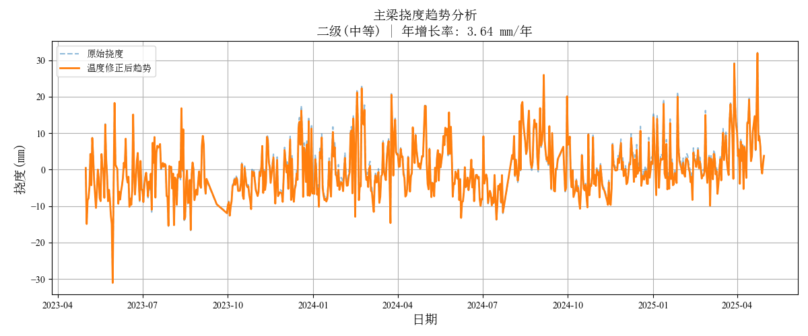
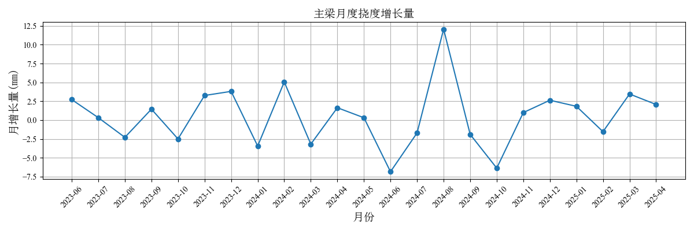
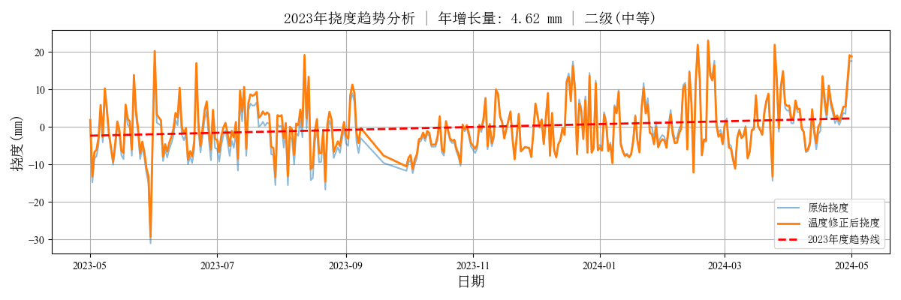
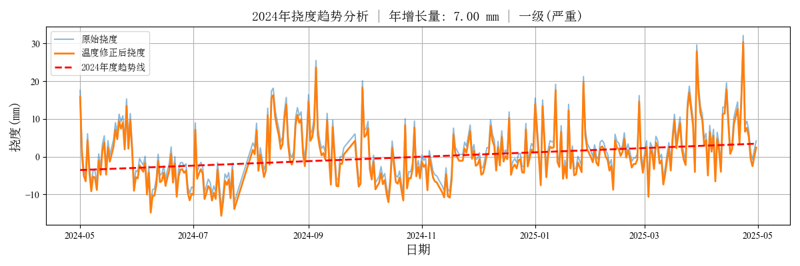

# 🌉 主梁持续下挠预警模型

> 城市生命线安全工程 | 结构健康监测 | 趋势分析 | 预警可视化

---

## 📚 项目背景

主梁的持续下挠是桥梁长期运营中的常见结构性病害。尽管桥梁在荷载作用下的弹性变形是正常现象，但随着时间的推移，若挠度持续增加，往往意味着潜在的结构风险，影响桥梁安全。

本项目基于统计建模与趋势分析技术，对长期挠度监测数据进行温度修正、趋势拟合和多级预警判别。具备 **历史数据分析、年增长率计算、可视化趋势图** 等功能，支持集成至省级城市生命线平台。

## 📌 模型简介
本项目为 ** **城市生命线安全工程监测平台桥梁预警体系核心子模块Ⅲ：主梁持续下挠预警模型**，旨在识别桥梁主梁在长期服役过程中可能出现的 **持续性挠度增长（下挠）问题**。  
模块结合温度修正、趋势拟合（线性回归）和滑动分析等方法，动态判断主梁下挠趋势是否超出设定阈值，实现多级预警。支持离线历史数据分析和图形化展示，可拓展集成至桥梁结构健康监测系统。

- **模块名称**：`progressive_deflection_alert`  
- **模型名称**：主梁持续下挠预警模型 
- **作者**：肖图刚  
- **开发时间**：2025年4月27日  
- **最后修改**：2025年5月27日

---

## 🌟 功能描述
✅ 加载并预处理历史监测数据（时间戳对齐、缺失值处理、降采样等）  
✅ 进行温度修正，剔除日周期性温度影响，获得真实结构下挠趋势  
✅ 滑动窗口回归，动态计算趋势变化率（挠度增速）  
✅ 自动判断是否持续下挠，并进行多级预警（正常、三级、二级、一级）  
✅ 统计各级异常点数量  
✅ 输出趋势图、预警判别图，直观展示挠度演变过程  
✅ 模块化设计，支持扩展集成到在线监控平台

---

## 📂 输入数据说明
- **格式**：本地 CSV 文件（3列、无表头）  
- **数据内容**：
  1️⃣ 时间戳（如 `2024-05-22 11:00:00`，本地时间）  
  2️⃣ 挠度数据（单位：mm）  
  3️⃣ 温度数据（单位：℃）  
- **数据来源**：犍为岷江大桥跨中截面同设备监测数据（2024-05-22 ~ 2025-05-22）  
- **采样频率**：1 小时；若原始频率非 1 小时，需预先重采样  
- **特别说明**：如挠度监测设备无测温功能，可引入附近温度点位数据并对齐时间戳

---

## 💾 输出结果说明
- **可视化图表（PNG）**：
  - 挠度变化趋势曲线
  - 预警等级判别线
  - 温度修正后的趋势曲线
  - 各级预警阈值线
- **可扩展输出**：
  - 年度下挠值
  - 预测趋势模型参数
  - 关键时间点等信息

---

## ⚙️ 开发环境与依赖
- **Python**：≥ 3.9.16
- **依赖库**：
  - pandas ≥ 2.2.3  
  - numpy ≥ 1.26.4  
  - matplotlib ≥ 3.9.4  
  - scikit-learn ≥ 1.5.2
  - tabulate ≥ 0.9.0

> 📝 **使用建议**  
>
> - 适用于大跨度桥梁主梁的长期结构行为趋势预警。  
> - 建议定期更新监测数据，结合结构状态分析开展趋势预警。  
> - 可拓展为子系统接口，集成至实时监控平台。

- **建议在虚拟环境中安装：**

```bash
pip install -r requirements.txt
```

## 💻 代码示例

📁 安装依赖并导入模块：

```bash
cd py_modu/progressive_deflection_alert
pip install .
```

✅ 成功安装：

```nginx
Successfully installed progressive_deflection_alert-0.1.0
```

⚙️ 运行示例：

```python
python example.py
```

`example.py` 示例：

```python
from progressive_deflection_alert import load_deflection_data, DeflectionAnalyzer
from progressive_deflection_alert.plotter import plot_deflection_trend, plot_monthly_growth

csv_file = 'D:/pycode/lifeline_bridge_alert/datasets/def_temp_2y.csv'
warning_thresholds = {"Level 1": 5.0, "Level 2": 3.0, "Level 3": 1.0}

# 数据加载与预警分析
df = load_deflection_data(csv_file)
analyzer = DeflectionAnalyzer(df, warning_thresholds)

corrected = analyzer.perform_temperature_correction()
growth, level = analyzer.estimate_annual_growth(corrected)
plot_deflection_trend(df, corrected, level, growth)

monthly_growth = analyzer.calculate_monthly_growth()
plot_monthly_growth(monthly_growth)

results = analyzer.analyze_annual_segments()
for r in results:
    print(f"周期: {r['周期']} | 年增长量: {float(r['年增长量']):.2f} | 预警等级: {r['预警等级']}")
```

## 📊 输出示例

```yaml
周期: 2023-05-01 - 2024-05-01 | 年增长量: 4.62 | 预警等级: 二级(中等)
周期: 2024-05-01 - 2025-05-01 | 年增长量: 7.00 | 预警等级: 一级(严重)
```

|    |  |
| ----------------------------------- | ----------------------------------- |
|  |  |

## 📦 平台要求

- **调用频率评估**：待填（建议根据实际系统负载能力设定）
- **性能**：待填（包含响应时延、数据量上限）
- **数据交互**：请求与响应需使用 JSON 格式（如集成到平台）
[返回首页](../index.md)