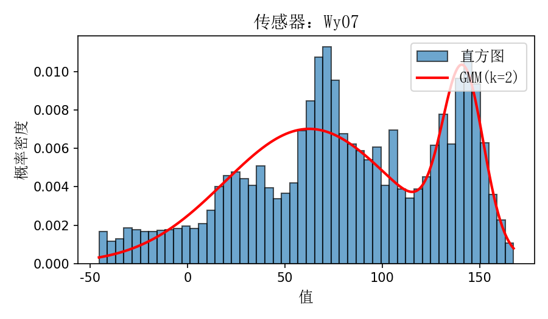

# 📈 统计分析模块

> 城市生命线安全工程 | 历史监测数据统计 | 分布拟合与检验 | 多传感器对比分析 | 高斯混合分布

---

## 📚 项目背景

在桥梁等基础设施的长期运行过程中，监测平台会采集大量结构与环境相关的数据。如何**面向历史数据开展批量统计分析，提取关键特征参数，识别潜在异常分布或数据漂移现象**，是省级城市生命线安全监测平台的重要功能。

为支撑用户按需查看监测数据的统计信息，本模块支持对**每种监测类型、每个传感器、指定时间段**的数据进行集中分析，输出包括**均值、方差、最大值、最小值**等统计特征，并通过 **高斯混合模型（Gaussian Mixture Model, GMM）** 拟合数据的分布形态，辅助进行分布假设检验和分布函数参数估计。

---

## 📌 模块简介

本模块为**城市生命线安全工程监测平台桥梁专项的数据分析子模块：统计分析**，用于指定时间段内任意监测点数据的自动化统计汇总与分布分析。模块兼容宽表与长表格式数据，支持 ISO 8601 时间戳解析，提供图形化的直方图 + 拟合分布函数曲线，可一键对比不同传感器或不同时段的统计特征。

| 项目               | 内容                                                      |
| ------------------ | --------------------------------------------------------- |
| **模块名称** | `stats_analysis`                                        |
| **核心功能** | 多传感器统计分析、分布拟合、时段对比、GMM 参数化建模      |
| **典型应用** | 各类传感器历史数据分析、平台后台统计、分布建模辅助        |
| **作者**     | 肖图刚                                                    |
| **开发时间** | 2025‑06‑10                                              |
| **最后修改** | 2025‑06‑19（新增GMM分布拟合功能，版本号升级至 v0.2.0） |
| **支持平台** | 省级城市生命线工程监测平台 / 地市级桥梁监测平台           |

---

## 🌟 功能描述

✅ **按时间段统计分析**：支持任意时间范围内数据查询与特征统计
 ✅ **多监测量、多传感器处理**：批量加载与处理传感器数据
 ✅ **核心统计量计算**：均值、方差、最大值、最小值
 ✅ **分布形态建模与拟合**：采用 k = 2 高斯混合进行参数估计
 ✅ **分布可视化**：直方图 + GMM 曲线叠加，便于人工判断数据特性
 ✅ **统计对比分析**：可对比不同传感器 / 同一传感器不同时段的变化
 ✅ **多形式输出**：终端表格、CSV汇总、GMM参数 NPY 文件导出

---

## 📂 输入数据说明

- **文件格式**：CSV 格式数据文件
- **时间列**：第一列必须为时间字段（`time`），推荐为 ISO 8601 格式字符串，其他时间格式可能需要程序修改兼容
- **支持格式**：
  - **长表模式**：`time, sensor_id, reading`（推荐用于平台结构化导出）
  - **宽表模式**：`time, sensorA, sensorB, …`（适用于本地批量采样数据，**目前采用**）
- **数据要求**：
  - 允许缺失值 NaN，内部自动剔除
  - 支持浮点型正负数值，不限制单位

---

## ⚙️ 运行环境与依赖

- **Python** ≥ 3.9
- **依赖库**

| 库               | 版本要求 |
| ---------------- | -------- |
| numpy            | ≥ 2.0.2 |
| pandas           | ≥ 2.2.3 |
| matplotlib       | ≥ 3.9.4 |
| scikit-learn     | ≥ 1.6.1 |
| tabulate（可选） | ≥ 0.9.0 |

---

## 🛠️ 使用说明

### 安装依赖

```bash
pip install -r requirements.txt
```

### 安装模块

```bash
pip install -e .
```

### 快速运行示例

```bash
python examples.py
```

或自定义运行：

```python
"""Quick start for gmm_stats"""
from pathlib import Path
from stats_analysis import run_pipeline

csv = Path("datasets/wy-temp_10min_3.csv")
fig_dir = Path("figures")  # Optional: specify a directory for figures
sensors = [
    "message-ba00cfd4-404d-2a85-e7d3-3a01897ad587",
    "message-fa7cc988-b44f-f54f-c265-3a0189655a95",
    "ZK_avg",
    "Wy07",
]
time_range = ("2022-07-01", "2022-12-31")

run_pipeline(csv, sensors, time_range, out_dir="reports",fig_dir=fig_dir, plot=True)

```

---

## 🔢 模块主要流程

1. **加载监测数据**：支持宽表 / 长表智能解析
2. **传感器筛选**：用户可指定多个传感器进行并行分析
3. **时间段限定**：按需指定分析的起止时间
4. **统计特征提取**：均值、方差、最大值、最小值
5. **GMM 建模**：自动拟合 2 分量高斯混合模型，输出权重、均值、协方差
6. **图形可视化**：直方图 + 混合分布函数曲线
7. **结果导出**：控制台打印、CSV 汇总、NPY 参数文件

---

## 📈 输出结果说明

| 类型         | 内容说明                                     | 示例文件                                    |
| ------------ | -------------------------------------------- | ------------------------------------------- |
| 控制台表格   | `tabulate` 中文表头格式，或 DataFrame 输出 | 自动输出至终端                              |
| 统计汇总 CSV | 传感器统计特征 & GMM 参数                    | `reports/stats_2022-07-01~2022-12-31.csv` |
| NPY 参数文件 | GMM 分布权重 / 均值 / 协方差                 | `reports/T01_gmm_means.npy` 等            |
| 拟合图像     | 直方图 + GMM 概率密度叠加图                  | 运行时弹窗（如需保存可手动导出）            |

---

## 🔍 对比分析功能说明

- **同一时间段，多个传感器** → 分析空间布设差异
- **同一传感器，不同时段** → 分析时间演化趋势
- **适用于温度、应变、位移、风速等连续型监测量**

> 平台用户可通过设置不同传感器 ID 与时间范围组合，灵活对比不同设备或不同时间段的统计信息，判断是否存在数值波动或分布形态改变，辅助判定异常工况。

---

## 📊 示例输出预览

**控制台输出**：

| 传感器ID/监测点编号                          | 均值   | 方差   | 最大值  | 最小值  | GMM权重          | GMM均值向量         | GMM方差              |
| -------------------------------------------- | ------ | ------ | ------- | ------- | ---------------- | ------------------- | -------------------- |
| message-ba00cfd4-404d-2a85-e7d3-3a01897ad587 | 15.55  | 81.907 | 36.613  | 0.014   | [0.6949, 0.3051] | [20.3861, 4.5354]   | [39.6485, 3.5629]    |
| message-fa7cc988-b44f-f54f-c265-3a0189655a95 | 15.193 | 80.071 | 33.386  | 1.08    | [0.6796, 0.3204] | [20.3168, 4.3246]   | [34.6558, 2.5899]    |
| ZK_avg                                       | 16.76  | 124.48 | 46.054  | -2.047  | [0.7655, 0.2345] | [20.8279, 3.4846]   | [90.6737, 4.5702]    |
| Wy07                                         | 81.094 | 2594.3 | 167.446 | -45.576 | [0.7642, 0.2358] | [62.4545, 141.5077] | [1887.5428, 109.108] |

```bash
统计结果结果已保存至 D:\pycode\lifeline_bridge_alert\py_modu\stats_analysis\reports
图像已保存至 D:\pycode\lifeline_bridge_alert\py_modu\stats_analysis\figures
```

**可视化图表**：




---

## 🔁 模块拓展建议

1. **支持 GMM 阶数自适应选择混合分布参数k**（AIC/BIC 评估自动确定最佳 k）,支持更多统计分析方法和概率分布模型
2. **滑窗统计与趋势检测**：分析监测量的演化过程
3. **集成 API 接口**：供生命线平台前端选择传感器后调用
4. **支持交互可视化**：结合 Streamlit/Dash 实现在线分析工具
