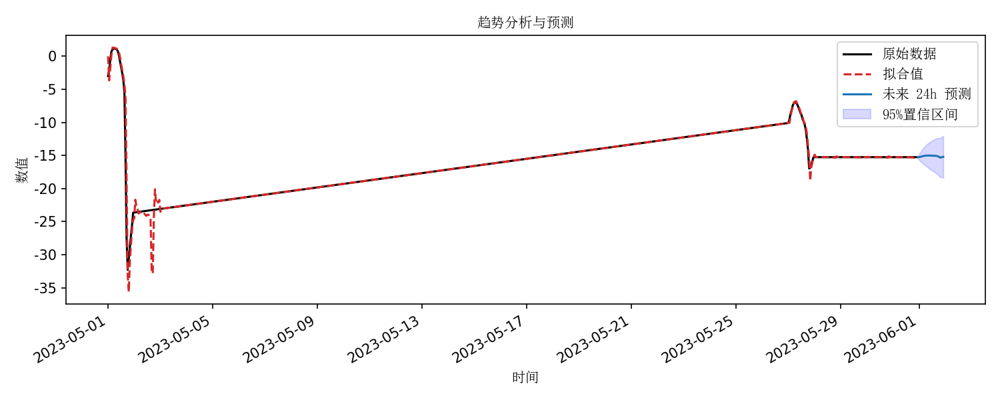

# 📉 趋势分析

> 城市生命线安全工程 | 监测数据趋势建模 | SARIMA 时序预测 | 响应变化特征识别 | 

---

## 📚 项目背景

在桥梁等城市生命线工程设施的长期运行过程中，传感器会持续采集关键结构或环境响应的时间序列数据。如何对这类数据的长期变化趋势进行有效建模与预测，是 **省级监测平台中保障预判能力与辅助评估能力的核心功能之一** 。

根据平台功能要求，趋势分析模块应具备以下两大能力：

1. **预测未来一段时间内的正常波动范围** ，通过与实际监测数据对比，评估其是否处于安全状态，识别潜在异常波动；
2. **提取时间序列特征变化趋势** ，包括长期趋势、周期变动、季节性波动及短期扰动，从而为巡检和维修提供支撑。

本模块基于  **SARIMA（季节性自回归积分滑动平均）模型** ，可对 **任意单变量监测数据进行趋势建模与 24 步（如 24 小时）滚动预测** ，输出包括**预测区间、趋势曲线、置信带图像**等关键结果，便于用户进行直观判断与趋势对比分析。

## 📌 模块简介

本模块为 **城市生命线安全工程监测平台桥梁专项的数据分析子模块：趋势分析** ，适用于各类连续型单变量监测数据（如应变、位移、温度等）的长期趋势识别与短期预测。

| 项目               | 内容                                                       |
| ------------------ | ---------------------------------------------------------- |
| **模块名称** | `trend_analysis`                                         |
| **核心功能** | SARIMA建模、24步趋势预测、预测区间绘图、历史对比分析       |
| **典型应用** | 桥梁主梁挠度趋势分析、支座位移趋势预测、应变数据安全评估等 |
| **作者**     | 肖图刚                                                     |
| **开发时间** | 2025‑06‑23                                               |
| **支持平台** | 省级城市生命线工程监测平台 / 地市级桥梁健康监测平台        |

---

## 🌟 功能描述

✅  **趋势建模** ：采用 SARIMA 模型，支持周期性与趋势性成分

✅  **24 步前向预测** ：例如 24 小时数据预测，贴合日常调度需求

✅  **置信区间输出** ：展示 95% 预测区间，辅助安全范围评估

✅  **趋势可视化** ：历史数据 + 拟合值 + 预测区间一图展示

✅  **异常识别辅助** ：可用于比对预测区间与实测值，判定是否超出正常波动

✅  **可扩展性强** ：支持修改预测步长、SARIMA 参数，适应不同任务

---

## 📂 输入数据说明

* **格式** ：CSV 文件，包含以下字段：
* `time`：时间戳列，推荐为 ISO 8601 格式（如 2024-06-01 08:00:00）
* `value`：对应监测值
* **频率要求** ：建议为 **固定 1 小时间隔（或可重采样为 1 小时）**
* **缺失值处理** ：自动重采样并剔除缺失值
* **样本长度** ：建议不少于一个月的连续数据（≥ 720 条）

---

## ⚙️ 运行环境与依赖

* **Python** ≥ 3.9
* **依赖库**

| 库          | 版本要求  |
| ----------- | --------- |
| numpy       | ≥ 2.0.2  |
| pandas      | ≥ 2.2.3  |
| matplotlib  | ≥ 3.9.4  |
| statsmodels | ≥ 0.14.0 |

---

## 🛠️ 使用说明

### 安装依赖

```bash
pip install -r requirements.txt
```

安装模块

```bash
pip install -e .
```


### 快速运行

```bash
python trend_forecast.py
```

示例代码（example.py）

```python
"""Minimal example for trend_analysis"""
from pathlib import Path
from trend_analysis import run_pipeline

csv_file = Path("datasets/def_1month.csv")
run_pipeline(csv_file)

```

默认设置将：

* 从 `datasets/def_1month.csv` 读取 1 小时数据；
* 拟合 SARIMA 模型，输出 24 步预测；
* 自动绘图并保存至 `figures/趋势分析与预测曲线.png`；
* 将预测结果保存至 `output/24h预测值.csv`

---

## 🔢 模块主要流程

1. **加载数据** ：读取时间序列，进行 1 小时重采样
2. **SARIMA建模** ：默认配置为 (1,1,1) × (1,1,1,24)
3. **趋势预测** ：输出未来 24 步预测均值与 95% 置信区间
4. **图像绘制** ：一张图展示历史数据、预测均值及置信区间
5. **结果导出** ：输出预测数据 CSV 与图像

---

## 📈 输出结果说明

| 类型         | 内容说明                       | 示例文件                        |
| ------------ | ------------------------------ | ------------------------------- |
| 趋势图像     | 历史数据 + 预测均值 + 置信区间 | `figures/趋势分析与预测曲线.png` |
| 预测结果 CSV | 含预测均值与置信区间           | `output/24h预测值.csv`  |

**图像示例：**

> * 黑色线：最近一周历史数据
> * 蓝色线：未来 24 小时预测值
> * 浅蓝阴影：95% 置信区间

---

## 📊 示例输出

### 控制台输出：

```bash
2025-06-23 16:58:36 [INFO] 图已保存至 D:\pycode\lifeline_bridge_alert\py_modu\trend_analysis\figures\趋势分析与预测曲线.png
2025-06-23 16:58:36 [INFO] 预测结果已保存至 D:\pycode\lifeline_bridge_alert\py_modu\trend_analysis\output\24h预测值.csv

 |   预测均值 |   下限 (95%) |   上限 (95%) |
|------------|--------------|--------------|
|    -15.234 |      -15.467 |      -15.001 |
|    -15.237 |      -15.693 |      -14.781 |
|    -15.204 |      -15.876 |      -14.531 |
|    -15.157 |      -16.034 |      -14.280 |
|    -15.117 |      -16.183 |      -14.050 |
|    -15.070 |      -16.311 |      -13.829 |
|    -15.041 |      -16.443 |      -13.638 |
|    -15.017 |      -16.569 |      -13.464 |
|    -15.008 |      -16.700 |      -13.315 |
|    -15.002 |      -16.826 |      -13.179 |
|    -15.005 |      -16.951 |      -13.058 |
|    -15.011 |      -17.075 |      -12.948 |
|    -15.019 |      -17.194 |      -12.845 |
|    -15.018 |      -17.298 |      -12.737 |
|    -15.034 |      -17.416 |      -12.653 |
|    -15.036 |      -17.515 |      -12.557 |
|    -15.044 |      -17.617 |      -12.472 |
|    -15.070 |      -17.733 |      -12.407 |
|    -15.124 |      -17.874 |      -12.373 |
|    -15.188 |      -18.023 |      -12.352 |
|    -15.308 |      -18.226 |      -12.391 |
|    -15.287 |      -18.285 |      -12.289 |
|    -15.246 |      -18.322 |      -12.170 |
|    -15.202 |      -18.354 |      -12.050 |
```

### 图表输出：



## 🔍 应用场景举例

* **主梁下挠**趋势持续下降 → 可提前发出维护预警
* **位移或温度**波动超出预测区间 → 可能存在结构性异常
* **预测区间接近报警阈值** → 可用于预防性巡检与调度

---

## 💡 模块拓展建议

1. **支持动态数据流**：接入生命线平台提取的在线数据
2. **增加多变量趋势建模** ：集成环境变量、车辆荷载等多源数据,同时支持位移、应变、裂缝、索力等结构监测数据
3. **支持滑窗预测** ：形成每日更新的动态预测能力
4. **集成 Streamlit 可视化** ：供平台前端选择传感器后自动分析
5. **扩展异常评分** ：加入 Z 分数、残差等异常检测指标
[返回首页](../index.md)